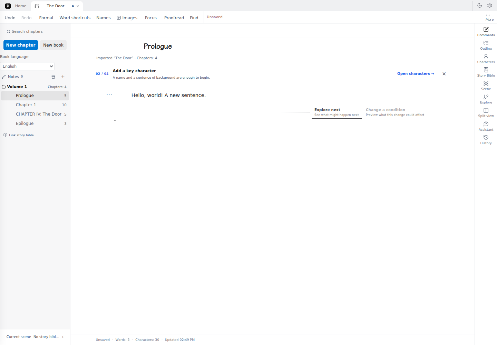

# Pinax

[简体中文](README.md) · [English user guide](docs/user-manual/en/README.md)

**A writing workspace that keeps you in control.**

Write your manuscript, organize characters and worldbuilding, and use AI when you need it. Writing, import, export and backups work without an AI key or account.

Pinax is a **Public Alpha**. Use the address provided by your invitation or run it yourself; this repository does not promise a universally available hosted service. English covers the main writing path; advanced worldbuilding, experiments and some auxiliary tools still have Chinese UI. Real-model literary quality and physical-device input remain separate acceptance checks.



<details>
<summary>Image workspace in English</summary>


Actual browser capture, 2026-09-22. The preview is the built-in style reference, not a newly generated result.

</details>

## Start writing

1. Open **Settings → Appearance** and choose **English**. This preference stays on your device.
2. Choose **New manuscript** or **Import TXT / Markdown**. Check imported chapters before creating the manuscript. Set **Manuscript language** if you want a writing-language default.
3. Write, develop character profiles, or request a review. AI suggestions are reviewed before being applied to the manuscript.
4. Export readable Markdown or keep a **Workspace backup (ZIP)**. Test restoring a copy before relying on a device migration.

The [quick start](docs/user-manual/en/01-quickstart.md) and [writing guide](docs/user-manual/en/05-writing.md) explain the controls. [Settings and backups](docs/user-manual/en/07-settings.md) cover model connections, data sending and restore behavior.

## Data and languages

Work is stored in this browser, using localStorage and IndexedDB for different data domains. There is no automatic cloud sync. Another browser, profile, hostname, protocol or port may have different storage. Keep backups and return to the original address before assuming work was lost.

Interface language, manuscript language and assistant explanation language are separate. Switching the interface does not translate existing content, rename chapters or regenerate AI output. Explanations can be Chinese while quoted passages and rewrite text remain English.

AI requests may send the selected passage, relevant context and references through the deployment server to the configured provider. Model keys are excluded from workspace backups. AI is optional; review suggestions carefully.

## Run locally

Use Node.js 22 (the repository requires `>=22.13.0 <23`).

```sh
npm ci
npm run dev
```

Run the backend in another terminal for API and help resources:

```sh
npm run server
```

Use the address printed by Vite. Model availability depends on the deployment configuration. See the [engineering documentation](docs/README.md) for deployment details.

## License

Pinax uses the **PolyForm Noncommercial License 1.0.0**. See [LICENSE](LICENSE) for the terms and commercial-use restrictions. Third-party components retain their own licenses.
