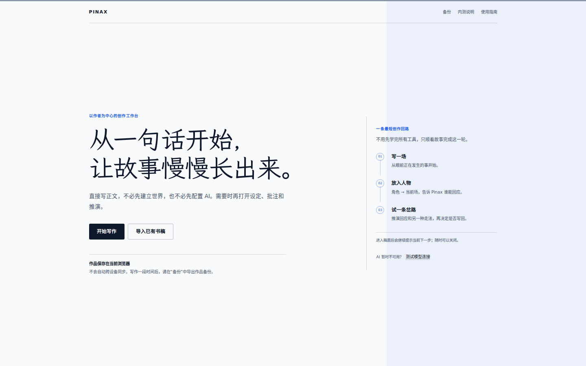
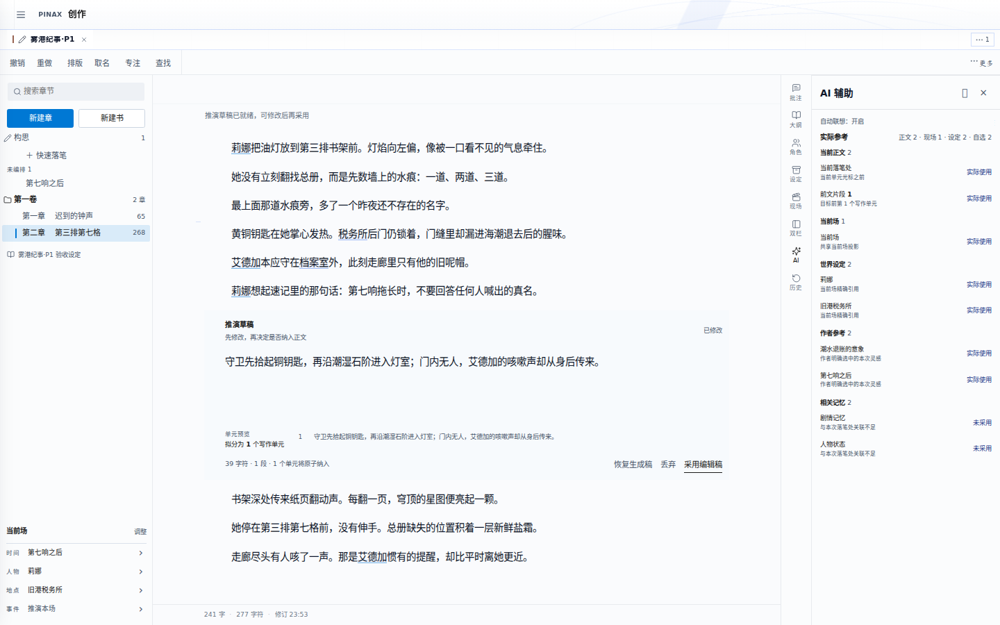

<div align="center">
  
  <h1>Pinax</h1>
  <p><strong>把故事留在作者手里。</strong></p>
  <p>Pinax 把正文、人物和世界设定放在同一个长篇创作工作台。</p>

  <p>
    <a href="https://github.com/Recoletas/Pinax/actions/workflows/ci.yml"></a>
    
    <a href="LICENSE"></a>
  </p>

  <p>
    <a href="#当前如何使用">当前如何使用</a> ·
    <a href="#可以怎样创作">创作场景</a> ·
    <a href="docs/user-manual/01-quickstart.md">快速开始</a> ·
    <a href="#保存隐私与-ai">保存与隐私</a> ·
    <a href="#开发者本地运行">本地运行</a>
  </p>
</div>



核心工作台提供基础写作和通用 AI 辅助：组织章节、编辑正文、批注、改写、续写和助手问答。关联世界书后，AI 可以进一步参考本书人物、地点、规则和历史，支持围绕作品设定的查询、人物回应与情节推演。生成的试稿先供作者查看和修改，确认采用后才进入正文。

**写作本身不需要 AI、账号或 API Key。** 章节、资料、正文保存和备份都可以独立使用。

## 当前如何使用

Pinax 当前处于 **Public Alpha**：公开仓库可供本地运行和小范围试用，但这不表示已有面向所有人的托管服务，也不等同于商业生产级成熟度。

- **受邀体验**：使用邀请方提供的网址；首次进入先查看[快速开始](docs/user-manual/01-quickstart.md)。仓库目前没有可核实的统一公开体验地址。
- **自行运行**：开发者可按下方[本地运行步骤](#开发者本地运行)启动 Web 版；AI 和部分媒体功能还需要启动服务端并配置渠道。
- **只想了解**：先看[作者使用指南](docs/user-manual/README.md)；工程状态、路线和测试证据在[工程文档](docs/README.md)。

访问地址会影响浏览器中的作品归属。**从临时地址切换到正式域名之前，请先在旧网址导出备份。** 新网址看不到作品不代表原稿已删除，应先回原来的网址和浏览器检查。

## 可以怎样创作

### 写一部长篇

新建书稿或导入 TXT / Markdown，按卷章整理正文、构思与大纲。正文自动保存在当前浏览器；查找、历史、排版和恢复不依赖模型。

### 关联世界书，增强 AI 创作

世界书承载本书的资料和设定。可以从资料导入开始，再整理各项设定；需要精细控制时进入高级条目，地图用于补充地理关系。关联到书稿后，工作台里的 AI 可以使用这些作品背景；不必为使用通用 AI 先建完整世界书。

### 需要时再请 AI 帮忙

针对选中的文字或当前场查询资料、比较路线、改写或生成试稿。Pinax 会显示本次参考的章节和资料；建议可以放弃或修改，采用前仍由作者决定。

<details>
<summary><strong>查看带参考资料的写作工作台</strong></summary>
<br>



</details>

## 创作流程

**基础流程**：新建或导入书稿 → 在核心工作台写作，按需使用通用 AI → 修改、保存与导出。

**世界书增强流程**：导入或添加资料 → 整理人物、世界观和创作规则 → 关联书稿 → 在工作台使用基于本书设定的 AI 查询、人物回应和推演。高级条目供精细管理，地图尚未完全融入这条流程。

**其他去向**：跑团在独立的体验页中进行；漫画和视频是按需探索的边缘扩展，不是写作的必经步骤。

书稿导入支持 TXT / Markdown；DOCX / PDF 属于资料页的来源导入。具体按钮和操作见[快速开始](docs/user-manual/01-quickstart.md)与[世界书与设定](docs/user-manual/03-worldbook.md)。

## 保存、隐私与 AI

Pinax 当前是本地优先的 Web 应用，不是云同步服务。

| 内容 | 当前边界 |
| --- | --- |
| 书稿与常用配置 | 主要保存在当前网址、当前浏览器的本地存储中 |
| 来源归档与媒体 | 主要保存在当前浏览器的 IndexedDB 中 |
| 完整工作区备份 | ZIP；包含书稿、设定、来源归档、已落盘媒体、记忆历史和事实账本；外部链接和未落盘内容可能不含在内 |
| 轻量备份 | JSON；适合快速留底，不包含来源原件、媒体原件和已归档的记忆历史 |
| 模型密钥 | 不进入 ZIP 或 JSON 备份；自定义配置需另行保管 |
| AI 请求 | 只有主动使用相关功能时，本次任务所需正文和资料才会发送到所选模型渠道 |
| 账号与同步 | 核心写作不要求账号；当前没有完整的多设备云同步 |

协议、主机名或端口变化都可能让浏览器把网页视为不同来源。换网址、换浏览器、换设备、清站点数据或使用无痕窗口前，请先导出备份。恢复可能覆盖当前内容，Pinax 会先显示新增、覆盖和跳过项目，确认范围后再继续。

AI 是可选项。应用里可见的内置 MiniMax 只有在部署者配置服务端密钥并且网络可用时才能调用；自定义渠道由用户自行配置。不要把密钥写入源码、`VITE_*`、日志或提交记录。

## 当前范围

核心 Web 写作闭环适合本地试用和小范围作者反馈。作品知识、受控生成和推演仍需持续验证真实模型质量；跑团、地图、漫画、视频、协作与 Electron 等属于扩展或实验工作面，不应成为作品唯一的保存路径。

准确状态以[项目状态](docs/STATUS.md)和[测试状态](docs/src/test-status.md)为准。自动化测试证明相应合同和流程能够运行，不替代真实作品、真机中文输入、长期数据可靠性或生成内容质量验收。

## 开发者本地运行

需要 Node.js `>=22.13.0 <23`（仓库提供 `.nvmrc`）和 npm。完整安装可能需要本机构建工具链来编译原生依赖。

```bash
git clone https://github.com/Recoletas/Pinax.git
cd Pinax
nvm use
npm ci
npm run doctor

# 终端 1：前端，默认 http://localhost:5173
npm run dev

# 终端 2：可选；AI 与部分媒体能力需要
npm run server
```

服务端渠道配置见 [server/.env.example](server/.env.example)。完整验证、架构边界和贡献流程分别见[测试说明](docs/src/test-status.md)、[当前架构](docs/engineering/current-architecture.md)和[贡献指南](CONTRIBUTING.md)。

## 文档与参与

- 作者：[使用指南](docs/user-manual/README.md) · [快速开始](docs/user-manual/01-quickstart.md) · [常见问题](docs/user-manual/08-faq.md)
- 部署与维护：[工程文档入口](docs/README.md) · [运维排障](docs/operations/troubleshooting.md)
- 开发：[当前架构](docs/engineering/current-architecture.md) · [代码地图](docs/src/code-map.md) · [贡献指南](CONTRIBUTING.md)

欢迎通过 Issue 和 Pull Request 参与改进。安全问题不要在公开 Issue 中披露；项目尚未公布独立私密渠道时，以 [SECURITY.md](SECURITY.md) 的当前说明为准。

## 许可证

Pinax 采用 [PolyForm Noncommercial License 1.0.0](LICENSE)：允许查看、修改和非商业使用，但它是 **source-available** 许可证，不是 OSI 定义下的开源许可证。商业销售、商业 SaaS、付费托管、商业集成或其他商业用途需要单独授权。

第三方依赖、字体、图片、演示素材、模型服务，以及用户自己的作品和生成内容，仍分别受其原始许可证、服务条款或权利归属约束。许可说明见[公开 Alpha 许可证说明](docs/engineering/public-alpha-license-notes.md)。
