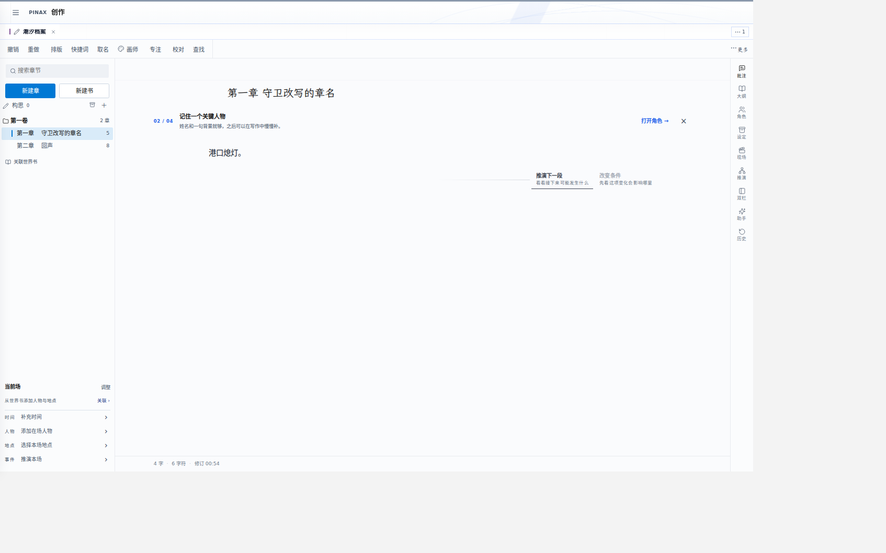

# Pinax

> **English short version:** Pinax is a local-first Chinese novel writing workbench — start writing from a single sentence, keep your manuscripts in your own browser and local server, and bring in AI drafting, story rehearsal and world settings only when you want them. Requires Node 22 (≥22.13). `npm ci`, then `npm run dev` (frontend) and `npm run server` (optional backend); writing, manuscript import (TXT/Markdown with GB18030/UTF-8 detection) and backup export work **without any API key**. Licensed under PolyForm Noncommercial (source-available, not OSI open source) — see [LICENSE](LICENSE).

Pinax 是一个**本地优先的中文小说创作工作台**：从一句话开始写作，不必先建世界、玩冒险或配置 AI；
需要时再打开设定、推演与素材工具，生成内容始终由作者审阅采用。


```text
正文 / 构思 / 大纲 ← 设定、地点、历史、体验素材
        ↕
  受控推演 → 可编辑草稿 → 作者确认采用
        ↓
  素材 / 插画 / 漫画 / 画布与分镜
```

数据保存在你自己的浏览器与本地服务中；没有账号，没有云端同步。项目以 **Public Alpha** 状态发布：
核心写作闭环可用，外围能力分级见下表，允许存在粗糙边缘。

## 15 分钟上手

需要 Node.js 22（≥22.13；仓库带 `.nvmrc`，`nvm use` 即可）和 npm。

```bash
git clone https://github.com/Recoletas/Pinax.git
cd Pinax
npm ci          # 完整安装（含原生模块编译，需要构建工具链）

npm run doctor  # 可选：自检环境（只读，不写任何配置）

# 终端 1：后端（默认 3001；可选，AI 相关功能需要）
npm run server

# 终端 2：前端（默认 5173）
npm run dev
```

打开 `http://localhost:5173`：

1. 点 **开始写作** 直接写；或选 **导入已有书稿**，预览 TXT / Markdown（自动识别 GB18030/UTF-8 编码）拆章结果后确认创建。导入与首章写作**无需任何密钥**。
2. 界面右侧是可折叠的创作工具栏：资料、批注、推演。写完点 **备份** 导出作品 JSON。
3. 需要 AI 时，在 **设置** 中配置自带模型渠道，或由部署者参考 [server/.env.example](server/.env.example) 配置服务端 `MINIMAX_API_KEY`。不要把私密 key 放进 `VITE_*` 前端变量。



截图来自本仓库自动化验收（合成稿件）实际运行的版本。

## 能力分级（2026-09-14，随版本更新）

| 能力 | 状态 | 依据 |
| --- | --- | --- |
| 写作（章节/构思/大纲/双栏/历史） | 可用 | 核心测试套件（20 文件/200 用例预算）+ 无密钥浏览器旅程 |
| 导入（TXT/Markdown 编码识别、DOCX/PDF） | 可用 | 导入测试 + CI 无密钥导入旅程 |
| 备份 / 低敏诊断导出 | 可用 | 隐私合同有测试断言（不含正文/密钥） |
| 设定 / 世界书往返 | 可用 | 设定联动测试与浏览器 Gate |
| 推演（右栏受控推演、草稿采用） | 实验 | 有浏览器 Gate 与合同测试；真实模型质量未做大规模验收 |
| 人物 IF / 体验入口 | 实验 | `/experience` 保留旧会话兼容，不是写作前置 |
| 地图引擎 | 实验 | P1/P2 有 Gate 报告；大规模世界性能未验 |
| 媒体（插画/漫画预设） | 实验 | 有组件级 Gate；实际生成质量依赖渠道 |
| 协作（多人共写） | 实验 | 传输/权限协议与故障矩阵已落地；真实双人 pilot 未完成 |
| 桌面端（Electron） | 实验 | 打包底座与旧数据迁移存在；Authoring→桌面项目真源适配未完成 |

"可用"指有自动化门禁覆盖且每轮验证；"实验"指能力存在但不应作为唯一作品数据路径。
测试状态详见 [docs/src/test-status.md](docs/src/test-status.md)。

## 数据边界

- 浏览器稿件与配置主要在 `localStorage`；来源归档、媒体使用 IndexedDB。浏览器清理、隐私模式和配额会影响保存——**请定期用"备份"导出作品**；本地优先不等于自动云同步。JSON 作品备份默认排除自定义模型 API Key，也不包含 IndexedDB 来源或媒体原件。
- 自带 API key 默认保存在当前浏览器，生成请求可能经服务端代理发送；内置渠道密钥由部署者放在服务端环境，禁止提交真实 `.env`。
- 服务端媒体缓存、协作数据库与 Electron 项目是独立数据边界；不要把 `data/` 或数据库当构建缓存删除。
- 前端不向任何第三方发起遥测；AI 请求只发往你在设置中配置的模型渠道。

## 贡献与安全

- 贡献流程、验证要求与数据边界约定见 [CONTRIBUTING.md](CONTRIBUTING.md)。
- 安全问题请勿使用公开 issue：见 [SECURITY.md](SECURITY.md)（私密报告渠道为公开前待设置项）。
- 第三方依赖与仓库内素材的来源/许可登记见 [THIRD_PARTY_NOTICES.md](THIRD_PARTY_NOTICES.md)。

## 当前分支与部署

- `main`：开发集成主线，功能优先从此分支建立隔离 worktree。
- `server-version`：下游生产适配分支；功能在 `main` 验证后再同步、适配，不直接在此开发普通功能。
- 临时集成分支及进行中的修改见 [STATUS.md](docs/STATUS.md)，README 不固定某一轮分支名。

部署前确认目标分支、环境配置和数据备份；不要直接覆盖服务器上的适配改动。在已检出并验证的部署分支中构建：

```bash
npm ci
npm run build
```

Express 提供 `dist/` 和 API。生产进程可按 [ecosystem.config.js](ecosystem.config.js) 使用 PM2 管理（需另行安装）；更新后端需重启对应进程，具体名称以部署现场为准。HTTPS、访问控制、限流、密钥与日志脱敏由部署者配置。

[deploy/](deploy/) 保留旧服务器模板；`setup.sh` 含 `/root/Pinax` 固定路径、Node 18 安装和系统级 Nginx 修改，不能作为当前通用一键安装器直接执行。

## 开发脚本

| 命令 | 说明 |
| --- | --- |
| `npm run doctor` | 只读环境自检（Node/原生模块/端口/密钥存在性） |
| `npm run dev` | 启动前端开发服务器 |
| `npm run server` | 启动 Express 后端 |
| `npm run test` | Vitest 监听模式 |
| `npm run test:run` | 一次性跑所有测试 |
| `npm run lint:delta` | lint 差分门禁（新增错误即失败） |
| `npm run build` | 生产构建到 `dist/` |
| `npm run docs:dev` / `docs:build` | VitePress 文档站 |
| `npm run verify:full` / `npm run verify` | 核心测试及预算、lint 门禁、Vite 构建、diff 检查、VitePress 构建 |
| `npm run verify:contract` | 核心测试和预算检查 |
| `npm run ci:authoring-smoke` | 本地复跑 CI 的无密钥作者旅程（含网络外发守卫） |
| `npm run desktop:dev` / `desktop:make` | Electron 开发/打包（平台验收另行执行） |
| `npm start` / `npm run stop` | PM2 启停生产服务 |

核心套件硬预算为最多 20 个文件/200 个用例。浏览器旅程、离线 eval 和真实 provider 测试另有前置条件，见 [验证说明](docs/src/test-status.md)；完整脚本以 [package.json](package.json) 为准。若已有开发服务运行，复用它，不为验收重复启停。

dev 代理默认指向 `127.0.0.1:3001`；多工作树并行时用 `PINAX_DEV_BACKEND_ORIGIN=http://127.0.0.1:<端口>` 指向各自后端（见 [vite.config.js](vite.config.js)）。

## 仓库结构

- `src/`：Vue 前端
- `server/`：Express 后端
- `shared/`：前后端共享合同与校验
- `electron/`：桌面进程、项目存储与迁移
- `docs/`：用户手册、开发文档、计划、日志
- `scripts/`：回归、诊断、基准、CI smoke 与发布检查
- `prototype/`：仍被研究/验证使用的实验原型，不是默认产品入口
- `agent-skills/`：仓库工作流规范
- `deploy/`：部署模板和脚本
- `ecosystem.config.js`：PM2 配置

## 文档入口

- 用户手册：[docs/user-manual](docs/user-manual/README.md)（快速开始见 [01-quickstart](docs/user-manual/01-quickstart.md)）
- 代码地图：[docs/src/code-map.md](docs/src/code-map.md)
- 已知风险：[docs/src/known-issues.md](docs/src/known-issues.md)
- 当前计划：[docs/PLAN.md](docs/PLAN.md)；近期变化：[docs/LOG.md](docs/LOG.md)
- 项目文档导航：[docs/README.md](docs/README.md)

## 许可证

Pinax 代码采用 [PolyForm Noncommercial License 1.0.0](LICENSE)。这是一种允许查看、修改和非商业再分发的 source-available 许可证，**不是 OSI 定义下的开源许可证**：商业销售、商业 SaaS、付费托管、商业集成或其他商业用途需要事先取得版权所有者的单独许可。许可证选型对照见 [docs/engineering/public-alpha-license-notes.md](docs/engineering/public-alpha-license-notes.md)。

本许可证只覆盖本仓库中由 Pinax 项目提供的代码和文件。第三方依赖、字体、图片、演示素材、模型服务以及用户自己的世界书、文章和生成内容，仍分别受其原始许可证、服务条款或用户权利约束。完整条款见仓库根目录的 [LICENSE](LICENSE)。
