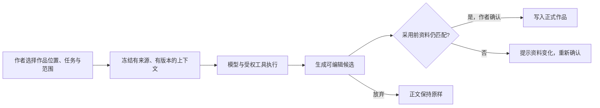

<div align="center">
  
  <h1>Pinax</h1>
  <p><strong>把故事留在作者手里。</strong></p>
  <p>本地优先、作者主导的长篇创作工作台</p>

  <p>
    <a href="https://github.com/Recoletas/Pinax/actions/workflows/ci.yml"></a>
    
    
    
    <a href="LICENSE"></a>
  </p>

  <p>
    <a href="#核心体验">核心体验</a> ·
    <a href="#快速开始">快速开始</a> ·
    <a href="#ai-如何进入作品">AI 工作流</a> ·
    <a href="#数据与隐私">数据与隐私</a> ·
    <a href="docs/user-manual/README.md">使用手册</a>
  </p>
</div>


Pinax 把正文、章节结构、人物与世界设定、作品资料和 AI 辅助放在同一个写作现场。作者可以从一句话直接开始；需要帮助时，再让 AI 在明确选择的作品范围内查询、推演或起草。模型产出始终是候选，只有作者确认后才会进入作品。

> Pinax 不是 AI 聊天套壳，也不是自动写完整本小说的流水线。没有账号、没有 API Key，仍然可以写作、管理资料、导入书稿并导出备份。

## 核心体验

<table>
  <tr>
    <td width="33%" valign="top">
      <h3>01 · 专注写作</h3>
      <p>正文占据主位。作品、卷章、构思和大纲围绕稿面组织，搜索、历史、排版与恢复不依赖模型。</p>
    </td>
    <td width="33%" valign="top">
      <h3>02 · 资料随写随用</h3>
      <p>人物、地点、设定和来源资料可以边写边补。从正文进入资料、修改后返回，作品、章节与落笔位置保持连续。</p>
    </td>
    <td width="33%" valign="top">
      <h3>03 · AI 只交付候选</h3>
      <p>查询、改写、续写和推演都受本次范围与版本约束。候选可编辑、可放弃，采用前再次核对资料变化。</p>
    </td>
  </tr>
</table>

### 写作现场，而不是功能大厅

- **长篇写作**：作品与章节组织、正文/构思/大纲、双栏参照、查找替换、历史与恢复。
- **人物与世界**：人物、地点、结构化设定、世界书条目、来源资料，以及正文与资料的精确往返。
- **作品知识**：按作品、章节、选区和作者指定范围查询，保留来源与版本信息。
- **创作辅助**：选文改写、续写、候选审阅、故事推演、路线对照和试稿采用。
- **导入与取回**：TXT / Markdown 中文编码识别与拆章预览、DOCX / PDF 导入、作品 JSON 备份。

地图、人物 IF、媒体生成、漫画、协作和 Electron 已有实现或接口，但仍属于实验工作面。它们不应成为作品的唯一保存路径；准确状态见[测试与能力状态](docs/src/test-status.md)。

## AI 如何进入作品

Pinax 的差异不在于多一个生成按钮，而在于生成结果如何安全地接近正文。



这条链路保留五个边界：明确目标、资料范围、工具授权、版本复核和作者确认。页面不会自行拼接整本作品交给模型，模型回复也不会绕过采用事务直接覆盖正文。

## 快速开始

### 环境

- Node.js `>=22.13.0 <23`（仓库提供 `.nvmrc`）
- npm
- 完整安装可能需要本机构建工具链来编译原生依赖

### 运行

```bash
git clone https://github.com/Recoletas/Pinax.git
cd Pinax
nvm use
npm ci

# 只读环境检查
npm run doctor

# 终端 1：前端，默认 http://localhost:5173
npm run dev

# 终端 2：可选后端；AI 与部分媒体能力需要
npm run server
```

打开 `http://localhost:5173`，选择**开始写作**或**导入已有书稿**。写作、浏览器本地保存和作品备份不需要 API Key。

<details>
<summary><strong>查看首次进入界面</strong></summary>
<br>


</details>

### 启用 AI

在应用的**设置**中配置自己的模型渠道，或由部署者参考 [server/.env.example](server/.env.example) 配置服务端渠道。

- 不要把私密 Key 写入 `VITE_*`、源码、日志或提交记录。
- 使用 AI 时，本次任务所需的正文和资料会发送到所选模型渠道。
- 自动化 fixture 验证协议和边界，不代表真实模型的内容质量。

## 数据与隐私

Pinax 当前是本地优先的 Web 应用，不是云同步服务。

| 数据 | 当前边界 |
| --- | --- |
| 书稿与常用配置 | 主要保存在当前浏览器的 `localStorage` |
| 来源归档与媒体 | 主要保存在 IndexedDB |
| 作品备份 | 可导出 JSON；默认不包含自定义模型 API Key |
| AI 请求 | 仅在主动使用相关功能时，向所选渠道发送本次任务所需上下文 |
| 账号与同步 | 核心写作不要求账号；当前没有完整的多设备云同步 |

浏览器清理数据、隐私模式、存储配额或设备故障都可能影响本地内容。请定期导出作品备份；作品 JSON 也不等同于来源和媒体原件的完整归档。恢复顺序和风险见[用户手册](docs/user-manual/README.md)与[已知问题](docs/src/known-issues.md)。

## 项目状态

Pinax 当前处于 **Public Alpha**。核心 Web 写作闭环与无密钥首访已有自动化覆盖，适合本地试用和小范围反馈，但尚不等同于商业生产级服务。

| 分级 | 范围 |
| --- | --- |
| **核心可用** | 写作、章节与资料管理、导入、本地保存、备份、设定与正文往返 |
| **Alpha** | 作品知识、受控生成、推演与候选采用；真实模型质量仍需持续验证 |
| **实验** | 人物 IF、地图、媒体、漫画、协作与 Electron；设备或真实多人验收不完整 |

测试通过只证明对应合同和旅程成立，不替代真实作品、真机中文输入或长期数据可靠性验证。当前证据见[项目状态](docs/STATUS.md)和[测试状态](docs/src/test-status.md)。

## 技术架构

| 层 | 技术与职责 |
| --- | --- |
| 前端 | Vue 3、Pinia、Tiptap / ProseMirror、Vite |
| 领域层 | composable 与领域工作流，负责会话、候选、采用和恢复 |
| 数据层 | 唯一数据 owner；浏览器存储为主，可选 Electron 项目适配 |
| 服务端 | 可选 Express 模型/媒体代理与协作接口 |
| 共享合同 | 前后端共用的生成、工具调用、授权与流式事件协议 |

新代码遵循“界面 → 工作流 → 唯一 owner → 持久化/平台适配”的方向，不在页面或移动宿主里建立第二份业务数据。详细边界见[当前架构](docs/engineering/current-architecture.md)、[代码地图](docs/src/code-map.md)与[src 服务指南](src/services/README.md)。

## 开发与验证

```bash
# 完整门禁：核心测试、预算、lint 差分、Web/文档构建、diff 检查
npm run verify:full

# GitHub Actions 中的无密钥作者主链
npm run ci:authoring-smoke

# 单独构建
npm run build
npm run docs:dev
```

核心 Vitest 套件有 20 个文件 / 200 个用例的硬预算；浏览器旅程、离线评测和真实渠道样本分别运行。完整命令以 [package.json](package.json) 和[验证说明](docs/src/test-status.md)为准。

## 文档与参与

- [使用手册](docs/user-manual/README.md) · [15 分钟快速开始](docs/user-manual/01-quickstart.md)
- [当前架构](docs/engineering/current-architecture.md) · [代码地图](docs/src/code-map.md)
- [当前状态](docs/STATUS.md) · [产品计划](docs/PLAN.md) · [开发日志](docs/LOG.md)
- [贡献指南](CONTRIBUTING.md) · [安全说明](SECURITY.md) · [第三方许可](THIRD_PARTY_NOTICES.md)

欢迎通过 Issue 和 Pull Request 参与改进。安全问题不要在公开 Issue 中披露；项目尚未公布独立私密渠道时，请以 [SECURITY.md](SECURITY.md) 的当前说明为准。

## 许可证

Pinax 采用 [PolyForm Noncommercial License 1.0.0](LICENSE)：允许查看、修改和非商业使用，但它是 **source-available** 许可证，不是 OSI 定义下的开源许可证。商业销售、商业 SaaS、付费托管、商业集成或其他商业用途需要单独授权。

第三方依赖、字体、图片、演示素材、模型服务，以及用户自己的作品和生成内容，仍分别受其原始许可证、服务条款或权利归属约束。许可选型说明见[公开 Alpha 许可证说明](docs/engineering/public-alpha-license-notes.md)。
