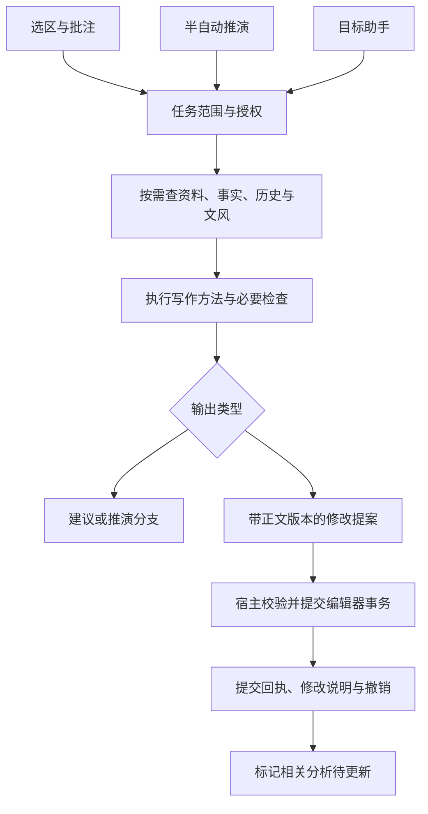

# 资料、记忆与写作 Agent：现状及合作建议

日期：2026-09-29。性质：源码调研与产品建议，尚未实施。

合作范围已按作者意见收敛为[资料导入优化与 Agent 工作流完善](../plan/writing-agent-collaboration.md)。本文保留前期调研记录，其中记忆扩展和对白试点等候选建议不作为外部贡献者的任务要求。

本轮读取 Pinax 当前工作树、三个外部项目的固定版本、Utopia 本地快照及相关研究。未执行外部项目、安装依赖、调用真实模型或复现其性能数据；未修改业务代码、提交或部署。工作树中此前的设定页切书改动保留。

## 1. 先确定 Pinax 要怎样帮助作者

作者提出的“Codex 和 Cursor 的结合”适合作为交互类比：既能交代一个目标让助手连续处理，也能在正文里随手批注、修改，写到岔路时再试演。这里不对两款产品当前功能作逐项比较。

Pinax 应围绕同一部作品，提供不同长度、不同授权范围的协作。界面入口决定默认范围和停顿位置，底层共享查阅、记忆、改稿与撤销能力。

| 入口 | 作者表达什么 | 系统可以自行做什么 | 应在哪里停下 |
|---|---|---|---|
| 选区、批注、局部改写 | “这里太啰嗦”“这句不像他说的” | 定位原文、查必要人物资料、生成局部修改 | 建议模式显示候选；明确要求替换且已授权时提交这一处 |
| 推演 | “如果他此时坦白呢？” | 查历史、判断各人的知情范围、延续行动后果 | 到作者需要选择下一步或设定发生重要分歧时；推演保存在分支，采用后才进入正文 |
| 助手 | “检查这一章的动机，把不顺的地方改好” | 拆任务、补查资料、检查、逐处修改、汇总结果 | 超出授权范围、有实质剧情取舍、资料冲突、达到预算或正文已变时 |
| 后台整理 | 正文保存、资料更新、稿件采用 | 标记分析过期、合并重复任务、更新可重建索引 | 提取的新人物、别名合并、权威设定变化等作为候选交作者决定 |

“自动、半自动、轻量”是任务策略，不必分别实现三套 Agent。轻量操作也可能查一次资料；长任务也可以在几步后停下。每次调用都应有作品、正文修订、目标范围和取消归属，但不要求每次操作都走规划—多轮调用—总结的完整流程。

**新手应当描述想达到的效果。** 工具、技能、运行轨迹可以按需展开，不让新手先选择工作流、路由器或若干 Agent。

## 2. 当前源码实际做到哪里

基线：`main@ebaebc562231adc1a77880d1c558b5a4a379b0a8` 加现有工作树。以下是代码接线判断，不等于公网真实模型验收。旧计划的“待接线”不能替代当前调用图。

| 部分 | 当前证据 | 主要缺口 |
|---|---|---|
| 资料导入 | `worldbookSourceArchive/Parser/Adapters/Selection` 已有来源、分块、修订和浏览器解析；`WorldbookSourcesPanel.vue` 有列表、筛选和预览 | 缺少清楚的资料用途、分析产物和持续更新流程 |
| 记忆提取 | 已有队列、冻结来源版本、重试、结构化候选、别名校验和缓存 | 引文定位与语义证据还需加强；提取方法变化的缓存失效不足 |
| 事实与历史 | Dexie 账本有证据、提案、事实版本、决定、拒绝记录；时序协调已进入提案/采纳链；历史界面展示闭合提案与冲突 | 应继续完善实际使用、回溯及跨存储恢复，不能把现有账本重建一遍 |
| 角色知情 | `knowledgeLedger.js` 有知情事件、角色读取和 provider 工厂 | 本轮在生产 `src` 中未找到 `recordKnowledgeEvent`、`createCharacterKnowledgeProvider` 的外部调用，不能宣称写入到推演的闭环完成 |
| 资料问答 | `useAuthoringKnowledgeAssistant` 冻结查询会话、收集证据、请求模型并检查版本 | 默认问答仍是先整理上下文再请求一次，缺少按模型需要连续搜索、读详情、补查 |
| 审稿与改写 | `useAuthoringReviewWorkflow` 已发送 writingSkill，检查服务端 applied 回执，支持 findings、局部补丁和撤销 | 更长任务的统一恢复、范围授权、多个入口之间的任务衔接尚需补齐 |
| 推演 | `authoringRehearsal.js` 确实调用 `runAuthoringRehearsalToolStep`；模型可选择 `history_lookup` | 每步最多查一次且限本次 manifest 授权历史；还不是随意查询全书的工具循环 |

### 2.1 推演的 Tool Call 不是空壳

当前路径：冻结现场及路径 → 有授权历史时提供 `history_lookup` → 模型可直接回答或查一次 → 工具结果回传 → 禁用后续工具生成最终 JSON。格式修复有上限；无授权历史或 provider 不支持相应能力时走普通请求回退。

因此，**推演已经使用 Tool Call，但不是每次都会调用**。源代码中的 `MAX_MODEL_STEPS = 3` 是模型请求上限，不能解释成能连续查三次资料。

现有重复拦截会检查去空白后的长段逐字复述。换一种说法重复同一件事仍可能通过。后续需要维护“已经发生的事件、当前状态、尚未执行的动作”，而不只是增加文本相似度阈值。

### 2.2 记忆也已有实质实现

`temporalCoordinator.js` 标明从 Utopia `ca4678084da46311c1d24cb65d05f340d8903e54` 移植了部分时序算法：只对声明为单值状态的关系生成闭合提案，缺时间或存在歧义时交作者处理。不能把这描述为“时序记忆完全没做”，也不能说已完整移植 Utopia。

当前需要区分三种历史：

- **稿件历史**：正文怎样修改、采用、撤销。
- **事实历史**：故事中何时成立，以及作者何时记录、更正或撤销这个判断。
- **任务历史**：助手查了什么、生成了什么、实际提交了哪些修改。

三者通过来源版本和提交回执关联。任务成功不能自动代表正文保存成功；正文采用也不能自动代表其中所有断言都变成权威设定。

本地 Utopia 快照为 `dbb92981b7f017f141d838f7b35ecb1788ad73d0`。其 ADR 0015 解释记录原话与确认事实的差别，ADR 0019 在该快照中仍标为 planned。本轮重新拉取远端失败，**没有核实 Utopia 最新 HEAD**，不据此判断它现在的开发进度。

## 3. 合作者的三个项目能带来什么

### NovelPedia：优先合作资料分析与文风画像

审阅版本：[`eb4f14018a61153023d32aed3679c1bb2682f336`](https://github.com/skkbsgzf/NovelPedia/tree/eb4f14018a61153023d32aed3679c1bb2682f336)。MIT。

可见章节/场景处理、实体归一、人物与设定分析、原始中间结果、SQLite、检索及文风分析模块。它适合作为批量分析器，产出可校验的分析包，由 Pinax 接收候选和证据。

接入前必须调整的地方：

- `extract_all` 的该处缓存按 scene_id 复用；文本变化但编号不变时，不能直接沿用。适配器需用内容及方法版本标识结果。
- `compare_10ch/compare_result.md` 的对比复用了既有场景数据库，不能把其中耗时解释为从原始小说完成所有处理的耗时；实体命中也不代表别名归一或全书理解准确。
- 文风 v2 主路径聚合场景、词频、句式、人物等已有结果，并做一次模型综合；缺数据时才降级到旧采样路径。情绪和修辞中的规则统计应标为粗略指标，不能包装为可靠的文学判断。

### Storyflow：适合合作写作方法及任务执行契约

审阅版本：[`bd1c8a1eb4354ee8c4fc5a2a5c6c5682ae35644e`](https://github.com/skkbsgzf/storyflow/tree/bd1c8a1eb4354ee8c4fc5a2a5c6c5682ae35644e)。仓库 VERSION 为 4.0.1，core 包标为 private、0.1.0；本轮未找到仓库跟踪的 LICENSE。直接复用代码前需要和作者约定授权、导出模块及版本。

它有实际 kernel、状态推进、预算、gate、工件和快照，CLI/MCP/HTTP 共用操作。当前 contracts 说明以 **module@1、flow@3** 为主，stage/kit 已废弃；不能按旧 stage 方案另建一套。

优先借鉴：把“对白检查”“人物动机检查”等方法写成有输入、输出和结束条件的任务；中途缺资料时请求补充；结果提交后拿真实回执。其文件系统项目状态不能直接替代 Pinax 浏览器里的稿件、账本和编辑器事务。

写作方法也要筛选。例如现有去 AI 味技能中的最低修改数量要求，不适合作为 Pinax 默认规则：好稿可以不改，修改数量不是质量指标。建议区分事实错误、可讨论的叙事问题和审美偏好。

### SkillRouter：后置接入，先当推荐器

审阅版本：[`54706a962575152ec384f4033d2f5eb64e1726f1`](https://github.com/skkbsgzf/SkillRouter/tree/54706a962575152ec384f4033d2f5eb64e1726f1)。MIT。

它实现能力导入、相关度排序、分层建议、使用历史及依赖计划，适合工具增多后的筛选。当前 `evaluate` 的非空、JSON 和词汇覆盖检查不代表小说质量。MCP 导入是工具目录快照，也需要更新。

执行前另需收紧：跨 toolkit 的工具 ID 应有命名空间；依赖环必须明确报错，不能把剩余节点并成一层继续当合法计划。Pinax 先筛权限允许的工具，再在其中排序；路由结果不增加权限。

初期工具数有限时，明确的任务分类和少量候选已足够。等实际记录显示工具选择有困难，再比较路由是否改善完成率、延迟与成本。

## 4. 资料页：从“文件列表”走到可使用的材料

### 4.1 先标用途，再决定怎样提取

建议每份资料允许选择用途，可多选，但产生不同类型的结果：

| 用途 | 合理产物 | 不应默认发生的事 |
|---|---|---|
| 本书正文/设定来源 | 人物、事件、关系、事实候选 | 将模型推断直接写成已确认设定 |
| 背景参考 | 可检索段落、摘要、出处 | 把现实资料自动当成本书世界规则 |
| 文风样本 | 文风画像、例句、适用场景 | 把样本小说的人物和剧情混入本书 |
| 写作方法 | 可供助手使用的方法说明 | 将资料里的命令当作系统权限或自动执行脚本 |

资料预览能查看“提取了什么、依据哪一句、用于哪里、是否过期”。普通使用默认只展示摘要与待处理项，详细分析按需展开。

### 4.2 文风提取值得做，但要能指导修改

建议产物由三层组成：

1. **可测特征**：句长分布、对白比例、段落长度、连接词与重复词等，注明统计方法和样本范围。
2. **模型解释**：视角、叙述距离、信息揭示方式、对白习惯、动作与感受的组织方式，附原文例子及不确定处。
3. **作者采纳的规则**：例如“人物紧张时先写小动作，再给一句短对白”；作者可编辑，限定叙述者、角色或场景。

不能只输出“细腻、克制、有画面感”。每条规则需要例子、适用条件和反例。动作场景、解释设定、日常对白应分开采样；固定种子和样本引用，避免重复分析时画像无故变动。

推荐流程：选资料与用途 → 生成画像草稿 → 作者删改 → 用一小段自己的文字试改 → 接受为本书或某角色的文风参考。跨书画像可作为显式选择的模板；切书不隐式带入另一书的资料或授权。

文风的接近程度不能靠“AI 味分数”或句长一个数字验收。需要盲评读感，同时检查是否添加剧情、改变人设或照搬样本文字。

### 4.3 最小分析包（建议合同）

合作双方先约定以下信息，不急着统一数据库：

- `projectId / sourceRef / sourceRevision / contentHash`：分析哪份材料。
- `analyzerVersion / promptVersion / model / schemaVersion`：怎样产生结果。
- `evidence[]`：原文范围、原文引用、分块及章节定位；范围须约定坐标单位并由宿主验证。
- `claims[]`：说话者、主张、否定/传闻/推测、故事时间、候选实体、证据引用。
- `styleProfile`：统计、解释、例子、适用范围和作者选定规则分别保存。
- `warnings / coverage / incomplete`：未处理或不确定的部分。

分析包只能导入派生结果或待确认候选。别名合并和事实修订通过 Pinax 既有服务提交；模型不能直接发数据库更新指令。

## 5. 记忆的下一步：更新可靠，使用准确

### 5.1 强化证据，而非只增加摘要

当前 `structuredExtraction` 的引文检查会去除空白后查找子串。这能排除部分凭空引文，却不能证明主张成立，也不能可靠区分正文里重复出现的句子。建议保存冻结原文的精确范围，必要时用规范化文本到原文的映射还原位置。

“有人说他死了”必须保留说话者与传闻属性；“打算杀他”不能成为已发生事件；角色误信与世界真实状态应分别查询。人物知情模块已有底层，应补事件写入、来源和推演消费，再讨论更复杂的推理。

### 5.2 避免频繁更新

- 输入过程中只标记受影响段落过期，不逐键调用模型。
- 使用推演/助手前，按所需资料范围检查修订；相同输入合并请求。
- 稿件采用或保存后，排队分析变化部分；大批导入显示进度并支持取消。
- 提供“重新分析”，可刷新失败或过期结果。
- 当前提取缓存已有 sourceRef、sourceRevision、原文哈希及有界 LRU；补充模型、提示词和 schema 版本，防止方法升级继续用旧结果。
- 资料删除或更新使依赖分析过期；已采纳事实保留历史证据，标记待复核，不静默删除作者的决定。

使用前检查与后台整理共用同一个协调器。当前场识别仍遵循“提出候选、作者确认入场”；明确要更改这一规则时，应单独定义授权，而不是借助手自动化顺便绕过。

## 6. 三种写作入口怎样共用能力

### 6.1 共享任务信息，按入口收紧策略

建议在现有 AT 合同上补明确：入口、作者目标、作品、分支、正文修订、选区/章节范围、允许工具、写入策略、模型与工具调用预算、取消信号、输出位置。

轻量改写可直接请求一次模型。推演可以有限补查，但输出仍停在分支；助手可以搜索—读详情—检查—提出多处改动。它们共享 provider 适配、工具权限、引用、版本检查和提交回执。

不要让“批注完成”只能在助手窗口里看，也不要让助手接手后丢掉批注位置。批注应能升级成更大任务：如“按这一条检查整章”，继承原来的意图和引用，同时明确扩大的范围。

### 6.2 自动修改的授权是任务级的

建议提供清楚的行为选择：

- **讨论/建议**：查阅和生成候选，不改正文。
- **替我修改**：作者明确给定范围后，允许在范围内自动提交改动，并展示改前/改后和撤销。
- **连续处理**：额外限定章节、停止条件和预算，按小批次提交；发生剧情取舍、事实冲突或范围变化时停下。

不需要每个低风险补丁都弹确认。也不能把“帮我看看”解释成整章重写。范围授权由可信宿主记录；模型的工具参数不能自行扩大。

这会扩展现有默认采纳规则，实施时需同步 AT 计划及用户界面。当前调研没有开启自动写入。

### 6.3 推演应当更可靠地推进事件

每步冻结：选中分支、已发生事件、人物/场景的最新状态、当前行动、尚未解决的问题、角色各自知道什么。模型输出除了文本，还返回本步新增事件和状态变化的候选。

对可确定的重复事件、已完成动作再次执行做结构检查；对疑似语义重复提示重试或交作者判断。不能声称用一次模型检查就能杜绝情节重复。

作者换路只修改相应分支；未采用的推演不能污染正文事实。采用到正文后再触发增量提取，下一次使用现场时提出新候选。助手可以帮助整理推演成稿，但仍需遵守本次正文授权和分支来源。

### 6.4 写入与撤销要能说明白

修改提案至少包含：目标、基准修订、原文定位、预期旧内容、替换内容、理由及参考来源。现有 host 的 applyPatches/撤销路径优先复用。

正文已被作者修改时，旧结果不能强行覆盖；应重新定位和检查，必要时重新生成。多个写任务不能同时占有同一段。保存失败时重试保存，不重新让模型生成另一份稿件。

“撤销本次助手修改”与“回到某个整章版本”要区分。连续任务的撤销应指向它实际提交的事务；不能覆盖作者期间的独立修改。

## 7. 怎么分工和安排顺序

### 第一项合作：一个能用的完整任务

建议共同选择作者有权使用的两章正文和一份文风样本，完成：

> 从样本提出可编辑的文风规则；理解正文人物关系及知情范围；按“把这段对白写自然，保留信息和关系”的指令生成局部修改；查看依据；采用或在明确授权下自动提交；能撤销；不把样本剧情混入本书。

这个任务同时检验他的资料理解与写作方法，也检验 Pinax 的上下文、编辑和记忆衔接。若这个闭环读起来仍差，应先改分析和方法，不急于引入大量技能。

| 工作 | 建议主责 | 交付物 |
|---|---|---|
| 资料/文风分析 | 合作者 | 独立分析入口、版本化结果合同、带证据样例、失败与增量更新说明 |
| 对白和一致性方法 | 合作者 | 输入/输出约定、何时补查/停止、保留内容规则、真实稿件对照 |
| 编辑、作品范围及持久化 | Pinax | 现有服务适配、修改事务、采纳/撤销、切书及失效处理 |
| 运行器对接 | 双方 | 一个明确任务的工具往返与中断恢复；决定是否抽取 Storyflow 模块 |
| 质量判断 | 作者与双方 | 人工标注事实及例外、修改前后盲评、失败归因 |

### 与现有计划对齐

本报告补充产品和合作方向，不创建平行施工路线：

1. AT-01 重新核对当前调用图：审稿前端已有接线，角色知情仍缺消费，不能沿用旧回执状态。
2. AT-02–06 补共享任务合同和助手补查；将上述对白任务作为首个真实使用案例。
3. AT-07–08 完善推演的状态连续性与分支隔离，保留作者决策节奏。
4. AT-09–12 承接增量识别、修改提交、撤销和恢复；自动写入作为明确策略扩展评审。
5. 资料分析/文风画像放到现有资料与记忆计划中，通过同一来源合同供各入口使用。
6. AT-13–14 收集真实质量证据再发布。SkillRouter 在工具数量和误选数据表明有需要时接入。

### 部署约束

当前公测免登录、作品主要留在浏览器，服务器只有 2GB 内存。第一阶段保留浏览器本地解析/统计、现有模型代理、按需发送相关材料。不要直接在该服务器部署本地 8B 模型或把每个访客映射成 Storyflow 的共享文件系统项目。

NovelPedia 可先提供离线分析包导入，或拆出轻量分析协议后由既有服务调用模型。若以后需要长篇后台云任务，再设计用户与任务隔离、上传数据保存周期及恢复；关闭网页后能持续执行不是当前浏览器任务天然具备的能力。

与合作者首次讨论应落到五件事：可独立交付哪些模块；Storyflow 授权与版本怎么定；分析包怎样保留证据及增量失效；谁负责提交真源；第一份共同评审稿件选什么。

## 8. 怎样知道确实变好了

以下是拟定验收，不是本轮执行成绩。

| 维度 | 首批必备反例/场景 | 看什么结果 |
|---|---|---|
| 事实理解 | 传闻、否定、计划、倒叙、同名人物、别名歧义 | 主张是否有据，错误合并率，缺资料时能否保留未知 |
| 角色知情 | 读者知道但角色不知道；角色误信 | 推演和对白是否泄露不该知道的信息 |
| 连续性 | 行动已发生、改换分支、采用后继续推演 | 不重新执行同一事件，旧分支不写进新分支事实 |
| 更新与隔离 | 改原文但保留章节 ID、切书、方法版本变化 | 旧结果失效，不跨书查询/写入，不误用缓存 |
| 改稿 | 多处局部修改、正文中途变动、取消、重复提交、保存失败 | 范围正确、提交幂等、可撤销、不覆盖作者新修改 |
| 文风 | 不同角色对白、动作与解释段、无需修改的好稿 | 盲评偏好、信息保留、人物一致；允许返回不必修改 |
| 操作负担 | 同一任务走原流程与新流程 | 作者操作次数、等待、采纳及撤销原因、模型成本 |

硬错误如错书写入、重复提交、覆盖新稿，应作为发布阻断。文学质量用对照和人工判断，不能以 JSON 合法、工具调用成功或模型自评分替代。

## 9. 调研依据与可继续阅读的资料

### 本地代码定位

- [推演工具调用](../../src/services/agents/authoring/authoringRehearsalToolRun.js)、[推演接线与逐字重复检查](../../src/services/agents/authoring/authoringRehearsal.js)。
- [助手问答](../../src/composables/useAuthoringKnowledgeAssistant.js)、[审稿和修改接线](../../src/composables/useAuthoringReviewWorkflow.js)。
- [角色知情](../../src/services/memory/ledger/knowledgeLedger.js)、[时序协调](../../src/services/memory/ledger/temporalCoordinator.js)。
- [提取缓存](../../src/services/memory/extraction/extractionResultCache.js)、[结构化提取](../../src/services/memory/extraction/structuredExtraction.js)。
- [既有 AT 计划](../plan/agent-tool-calling-20260927.md)、[施工任务卡](../plan/agent-tool-calling-execution-20260928.md)。

### 外部依据

- [NovelPedia 文风实现](https://github.com/skkbsgzf/NovelPedia/blob/eb4f14018a61153023d32aed3679c1bb2682f336/src/style_sampler.py)、[提取实现](https://github.com/skkbsgzf/NovelPedia/blob/eb4f14018a61153023d32aed3679c1bb2682f336/src/extract.py)、[十章对照报告](https://github.com/skkbsgzf/NovelPedia/blob/eb4f14018a61153023d32aed3679c1bb2682f336/compare_10ch/compare_result.md)：代码与作者自报实验，未经本轮复现。
- [Storyflow contracts](https://github.com/skkbsgzf/storyflow/blob/bd1c8a1eb4354ee8c4fc5a2a5c6c5682ae35644e/contracts/README.md)、[kernel](https://github.com/skkbsgzf/storyflow/blob/bd1c8a1eb4354ee8c4fc5a2a5c6c5682ae35644e/core/src/kernel.ts)：用于判断现有运行时及合同，而非只看项目介绍。
- [SkillRouter core](https://github.com/skkbsgzf/SkillRouter/blob/54706a962575152ec384f4033d2f5eb64e1726f1/src/core.mjs)：用于判断推荐、历史、依赖计划与执行边界。
- [Agent Skills specification](https://agentskills.io/specification)：技能的说明与按需加载约定可参考；SKILL.md 本身不授予运行权限。
- [Anthropic：Effective context engineering](https://www.anthropic.com/engineering/effective-context-engineering-for-ai-agents)、[Writing tools for agents](https://www.anthropic.com/engineering/writing-tools-for-agents)：参考按需查阅和面向任务设计工具；其供应商实验数据不直接外推到 MiniMax。
- [MCP 工具 annotations 说明](https://blog.modelcontextprotocol.io/posts/2026-03-16-tool-annotations/)：元数据提示不能代替宿主执行权限。
- [FABLES](https://arxiv.org/abs/2404.01261)：逐条检查小说摘要主张的忠实性，发现事件及人物状态错误，模型裁判也有限制。对 Pinax 的启示是保留证据并由人工核对，非沿用其 2024 年模型排名。
- [NoCha](https://arxiv.org/abs/2406.16264)：使用长篇小说中差别很小的真假主张考察跨全文理解。可借鉴反例设计；其英文书和旧模型结果不能作为当前中文模型准确率。

后续实施应补中文真实稿件与当前 MiniMax 的对照数据。本轮能够判断结构是否适配，不能凭源码确定最终写作效果。
