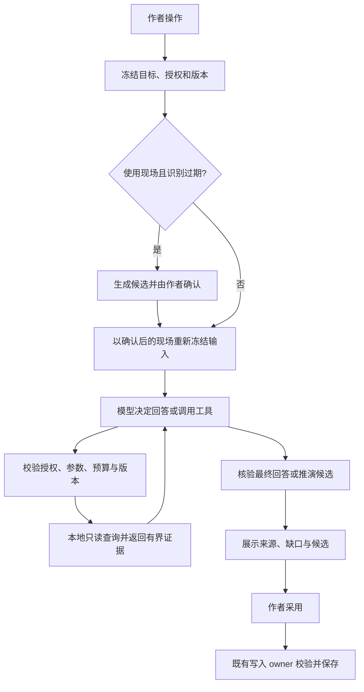

# Agent 工具调用与作者工作流实施计划

日期：2026-09-27；2026-09-28 修订。证据级别：**AT-00 前置修复部分实施；AT-02–14 功能包未验收**。执行者须先读[施工约束与逐包任务卡](./agent-tool-calling-execution-20260928.md)，其中对基线、顺序和入口的修正优先于本文件早期措辞。MiniMax 的[需求/执行报告](./agent-tool-calling-requirements-20260928.md)保留为来源证据，报告数字不自动视为复验结果。

本计划承接[当前产品计划](../PLAN.md)、[运行时成熟化任务书](./nightly-20260918-runtime-maturity.md)、[助手写作 Skills 方案](./assistant-writing-skills-20260919.md)和本地推演续接/现场识别改动。它细化同一产品路线中的工具调用工作，不替代跑团、协作、漫画等独立计划。当前调研对象是本地 `main` 工作区（含未提交改动），未确认公网部署与本地一致。

## 1. 目标与交付边界

作者应能完成以下流程：

1. 向助手提出需要多处依据的问题，助手主动搜索、读详情、必要时补查，再给出可回原文的回答。
2. 在正文任意位置开始或继续推演，系统区分正文事实、当前分支已发生事件、角色所知和未采用候选，接着现有进度生成。
3. 使用角色或推演前，仅在相关资料变化时更新现场候选，由作者确认后入场；保留手动“识别当前场”。
4. 编辑、换章、切作品、取消或刷新后，旧请求不能覆盖新结果，保存失败不会导致再次生成或重复采纳。
5. 作者能看懂正在查什么、缺少什么、结果为什么需要重新确认；诊断详情可展开，正文保持稳定。

首批范围：右侧知识助手、普通推演、当前场识别，以及它们共用的工具协议与执行机制。正文叙事引擎是复用来源和回归对象。审稿/改写沿用已有工作流，在首批稳定后接入共享查询能力。

本期不引入自主多 Agent 协作、任意脚本执行或第三方 MCP 插件市场；不开放模型直接写正文、世界书、现场和正式记忆。MCP 作为以后外部工具接入边界，首批本地资料查询不依赖它。生图、网页研究等已有专用工作流保留原职责。

## 2. 代码基线与问题分级

| 已核对入口 | 当前事实 | 本期动作 |
|---|---|---|
| `src/services/agents/agentExecutionEngine.js` | 目前仅由 settingsTaskDispatcher 消费，不是助手/推演统一入口 | 本期不改、不强行接入助手；公共循环直接供现有任务调用方使用 |
| `src/composables/useAuthoringKnowledgeAssistant.js`、`authoringKnowledgeQuerySession.js` | 先 prepare 证据，再经 advisor 单次回答；模型没有补查循环 | 保留证据准备/引用核验，接入主动补查 |
| `server/services/textModelAgentProvider.js` | 普通文本请求与有界结果修复，未在该请求中声明查询工具 | 工具任务走已有工具传输，普通任务继续原通道 |
| `src/services/agents/authoring/authoringRehearsalToolRun.js` | 只开放一次 `history_lookup`；随后关闭工具；无授权历史则直接回退 | 改为有界多轮读取，加入当前状态与设定资料 |
| `src/services/agents/narrativeAgentOrchestrator.js` | 已有阶段、工具循环、预算、超时、重复调用控制及 transcript | 先提取最小公共能力，保持叙事规划策略独立 |
| `src/services/agents/narrativeToolRegistry.js` | 已有授权、参数校验、分页版本、缓存、结果边界和错误返回 | 扩展现有注册/执行机制，不复制第二套 |
| `server/services/toolCallingProviderAdapter.js` | 支持多种协议；部分能力标记固定，工具 turn 采用非流式上游请求 | 接通能力探测与真实请求策略，明确降级 |
| `src/services/agents/authoring/authoringSceneRecognition.js` 与 `Authoring.vue` | 本地已有名称/关键词候选与使用时确认，协调状态仍在页面 | 迁出协调逻辑，补增量、版本、否定/回忆语境与采纳衔接 |

已确认的协议差异：试演的 `assistantToolMessage` 仅重建 content/toolCalls，未保留响应 parts 中的协议字段；正文循环有保留处理。对推理模型的具体影响需要真实 provider 验证，不能提前登记成已复现故障。也需检查 adapter 自身是否完整往返，不能仅修调用方就宣告兼容。

已有回归资产包括 `agentContracts.test.js`、`narrativeKernelExecutor.test.js`、`authoringAgentWorkflows.test.js`、工具授权 eval、推演后果矩阵与 provider smoke。实施前确认实际覆盖，复用现有断言和脚本；协议通过不等同于文学质量通过。

## 3. 运行职责与授权设计

### 3.1 一次任务如何运行

浏览器继续拥有本地作品数据与查询执行；服务端负责 provider 调用、请求协议校验、超时和中断传播。不要假设服务器能直接读取作者浏览器的数据库。只把本次必要证据送入模型请求。

公共运行器负责循环、transcript、预算、取消、回执；任务策略负责允许哪些工具、如何结束、怎样校验最终结果。查询工具负责读取资料，模型适配器负责协议翻译，现有 repository/coordinator 负责正式写入。新增模块放入现有领域目录，页面只协调 UI。

### 3.2 授权范围与已读证据分开

- trusted application 冻结允许读取的 project、document、source、branch 和角色视角范围，模型参数不能扩权。
- evidence 集合记录本次实际读到的片段，可随合法补查增长。最初检索命中项不是整轮唯一可读范围。
- 如果当前 manifest 仅授权具体来源，本轮只能在该范围内查询。扩展到整本书必须由可信任务策略构造新授权，不得由模型提供 bookId 越过边界。
- 首批不要求复制整个项目快照；冻结依赖 revision，查询结果必须匹配。不能提供旧版本读取时，相关依赖变化即结束为 stale，允许作者重新运行。
- 工具结果带 sourceRef、locator、revision、证据状态和截断/分页信息；未确认资料、推演分支、正式事实、角色知识不能混成一种来源。
- 执行前及结果发布/采纳前分别检查作用域、版本和请求所有者；仅在目录隐藏工具不足以保证授权。

### 3.3 统一运行状态与回执

建议复用并扩展现有 run/session 合同，落字段前先核对既有 owner：

| 信息 | 最小字段或语义 |
|---|---|
| 身份 | runId、taskId、requestToken、projectId、targetRef、branchId |
| 输入 | 授权摘要、依赖 revision 集合、用户目标、目标范围、角色视角 |
| 状态 | preparing / awaiting-confirmation / running / completed / partial / cancelled / stale / failed / interrupted |
| 预算 | 模型步数、工具调用数、查询轮数、输入/结果体积、总截止时间、重试次数 |
| 工具回执 | callId、工具名、动作、来源引用、耗时、缓存命中、结果数、截断、错误码 |
| 结果 | 最终回答/候选引用、证据缺口、可采纳状态与原因、已保存状态 |

保存最小回执和候选引用，不把密钥、完整协议推理块或整本稿件放入日志。协议所需不透明字段仅按 provider 要求用于当次往返，不展示为作者可见思考过程。

## 4. 工具集合与任务策略

以下名称为设计名，AT-02 冻结时与现有合同对齐；尽量以现有工具 action 或授权 reader 扩展实现，避免一项查询出现多个重叠工具。

| 能力 | 主要输入 | 输出/边界 | 首批入口 |
|---|---|---|---|
| 作品搜索 | query、允许的资料类别、limit、cursor | 有界摘要、来源、版本、下一页；正文/大纲/速记使用各自生产 reader | 助手 |
| 按引用读详情 | 已授权 sourceRef、局部范围 | 精确片段与必要上下文；禁止整本导出；搜索结果可继续读取 | 助手、推演 |
| 当前状态读取 | 可信目标与分支、角色视角 | 当前落点、最近动作、已发生后果、待回应义务、已确认现场 | 推演、相关问答 |
| 既有设定/历史/记忆查询 | 现有 world/history/memory 工具参数 | 沿用证据授权；角色所知另行过滤，缺依据返回 unknown | 助手、推演 |
| 现场候选提取 | 冻结片段、已确认现场、可匹配实体 | 仅候选及原文依据；支持入场/离场/地点变化/不确定 | 使用时、手动识别 |

地理/政治仅在任务与现有授权要求满足时开放。当前状态由程序在每次推演前必读，不能依赖模型碰巧调用；模型工具用于进一步核对。候选提取可由确定性规则和可选模型阶段组合，不能靠名称出现直接认定在场。

工具错误需区分：参数可修复、无结果、未授权、版本过期、取消、暂时服务失败。可修复错误返回模型进行一次有界纠正；未授权不得扩大范围重试；版本过期与取消结束该 run；无结果允许解释缺口。并行只用于互不依赖的只读查询，搜索后的详情读取必须后续执行。

### 4.1 初始预算（待评测校准，不是当前成绩）

| 任务 | 查询结果轮数 | 工具总调用 | 模型总步骤（含修复） | 整轮截止时间 |
|---|---:|---:|---:|---:|
| 助手普通问答 | 3 | 6 | 5 | 100 秒 |
| 推演一步 | 2 | 4 | 4 | 100 秒 |
| 现场识别 | 本地规则优先，最多 1 次模型分类 | 不开放递归查询 | 2（含一次格式修复） | 45 秒 |

初值优先复用现有单项/单轮结果长度限制；总输入同时受共享协议限制和模型上下文余量控制，不能叠加多个单项上限造成溢出。同一工具+参数+资料版本第二次重复优先复用回执，连续无新增证据时停止补查。provider 暂时错误最多一次重试且计入总预算；模型不支持工具时明确降级为冻结证据回答，不伪造工具成功。实际预算在页面诊断可查，日常界面只显示查阅/生成阶段。

## 5. 助手问答闭环

1. 保留当前 prepare 的可信目标、初始资料和引用校验，为模型提供资料目录摘要与允许的查询工具。
2. 模型按需补查，逐轮累积实际证据；局部问题只读局部，不预装全书。
3. 最终沿用 knowledgeAnswer 结构校验与来源回跳；引用必须来自本次读到的证据。资料不足必须明确缺项，不能把自由建议写成作品事实。
4. 连续追问传递有界对话摘要、上一轮结论和引用；重新检查引用版本。过期内容可作为“之前的说法”，不可继续充当当前证据。
5. 作者选区、当前章节和整书意图分别形成可信范围；跨作品、切换目标或取消时切断旧 run 的发布权。
6. 审稿/改写后续按任务策略消费同一查询底座；既有 finding、rewrite target、采纳与撤销 owner 不变。目标审稿方法属于任务指导，不能冒充可执行工具。

验收示例：“甲什么时候知道钥匙被换了？”至少能搜索事件、读取原文并核对知情来源；没有证据时回答无法确定，而不是因甲出现在附近就推断知情。

## 6. 推演连续性与正文采纳

### 6.1 每步必备状态

从现有 run/path/manifest 构造有界状态：插入位置前的正文、当前分支已完成步骤、最近一次后果、尚未完成动作、作者本次指令、当前角色与地点、角色所知及未知。插入位置之后的正文可用于作者层面的冲突检查，但不能默认变成当前角色已经知道的未来。

明确四种内容：已存在正文、当前分支已发生但尚未写入正文的推演、其他分支候选、未确认记忆。只有前两者可以约束本分支“已经发生过”；其他分支不能串入，正式记忆晋升继续走原有审核。

### 6.2 生成与重复检查

- 每一步从最后后果接续，不重新执行已完成事件；重开场景和环境描写要有叙事需要。
- 保留现有逐字复述拦截，补结构化事件/动作对照；重复提及不等于事件重复发生，摘要、回忆和角色反应需区别处理。
- 首批使用确定性事件状态与模型结果中的有界结构字段交叉校验；只有高置信冲突阻止采纳，语义不确定时展示可解释提示。
- 允许一次针对冲突的修复请求，仍失败则保留失败原因和可读候选，不无限重试，也不静默重复原稿。
- 生成完成时检查目标和分支版本；作者期间编辑了依赖片段，结果保留为过期候选，重新确认/生成后才能采用。

### 6.3 采用事务

正文插入、采用回执和后续失效通知由现有 owner 协调；重复点击只写一次。保存失败保留候选，只重试保存。成功后将实际插入范围标为现场识别待更新；部分采用只处理采用的句段，不能把未采用推演后果写成正式事实。撤销与恢复同样更新版本和识别状态。

## 7. 使用时识别与作者确认

### 7.1 触发规则

| 事件 | 行为 |
|---|---|
| 普通输入、粘贴、删除、撤销、重做 | 仅记录变化范围与 revision，不逐键请求模型 |
| 推演文本/改写采用进正文 | 采用成功后标记实际写入范围失效 |
| 点击推演或依赖现场的角色操作 | 检查缓存；无有效结果则识别一次，出现需要确认的变化后暂停后续动作 |
| 手动“识别当前场” | 对当前范围重识别；与同版本在途请求合并，不并发重复请求 |
| 世界书实体/别名、场景锚点、作者现场变化 | 使相关识别依赖失效 |
| 切作品/章/场或关闭未提交入口 | 取消该入口的待继续动作；旧响应无权更新当前场 |

缓存键至少包含 projectId、documentId、scene/anchor、识别范围指纹、正文依赖版本、世界书版本、现场版本和识别策略版本。相同快照使用 single-flight。识别分片需要上下文重叠；否定、回忆和代词可能跨句，不能只传发生变化的几个字。无法定位变化范围时，回退到当前场有界重扫，明确超出范围未检查。

### 7.2 候选与确认

候选包含实体 ID/类型、建议动作、证据位置/引文、理由、确定程度和来源版本。同名/别名歧义保留待选；“提到某人”“回忆某人”“某人不在这里”不自动入场。离场和地点更换同样需要证据，不因本段没提到就删除角色。

作者可选择“应用所选并继续”“沿用当前场继续”“取消”，并能手动修改。应用前再次检查版本，保存成功后才启动被暂停的推演；保存失败留在确认处。沿用当前场的决定只对该版本/范围生效，不能永久屏蔽后续新证据。无变化自动继续，不重复弹窗。

确认期间正文再次变化，候选标为过期并重新识别；作者确认后重新冻结生成输入，避免使用确认前的旧现场。修改未相关片段可在明确依赖范围后复用缓存，不能仅靠整章计数反复重算。

## 8. 交互、取消与恢复

- 沿用右侧助手/推演面板，阶段提示为“查阅资料”“核对当前进度”“生成中”。来源与工具详情折叠，不新增正文常驻运行面板。
- 保持段尾两枚图标、悬浮文字、零段距占位；鼠标、键盘和触屏都有可用说明。关闭未提交面板、换位置、切工具后恢复入口，避免遗留“继续推演”字样。
- 请求取消贯穿 UI、查询 reader、服务端请求和 provider；取消后阻止发布。不能保证上游停止计费时，不把 UI 停止等同上游已终止。
- 网络中断/刷新恢复为 interrupted，保留最小回执与已有候选，不自动重发模型。重新运行创建新 run 并重新冻结依赖。
- 有效候选保存失败提供“重试保存”；查询失败提供“重新查询”；两者明确区分。
- 1440/1024/390 宽度、明暗主题、缩放、IME、键盘焦点纳入验收；不得破坏选中文本批注/素材浮条、速记标题编辑和长稿滚动。

## 9. 可执行任务队列

AT 编号是本计划内任务标识，不另设一条产品路线。AT-01 已有执行者基线报告；AT-00 已有部分代码，剩余结构/体积与行为验收未通过；AT-02 起仍待实施与验收。每包完成后记录实际差异、验证、限制，禁止用旧计划成绩代替。

| 编号 | 范围与主要文件/目录 | 依赖 | 交付与通过条件 |
|---|---|---|---|
| AT-00 | 结构检查跨平台路径、旧 UI 断言、现场协调迁出、Authoring bundle | 01 基线报告 | 不改预算；完成剩余行数/体积整改并核对原交互，详见施工任务卡 |
| AT-01 | 核对本地 WIP、旧 T09–T12/S06–S12 与当前调用图 | 无 | 已实现/待接线/待验证逐项映射；保留现有用户修复，确定实施基线 |
| AT-02 | `shared/`、agents/context：run、工具目录、授权/证据边界 | 00,01 | 冻结 schema、错误类别、预算和状态转换；每字段有既有 owner 或明确归属 |
| AT-03 | provider adapters、generation transport、能力探测 | 02 | text/call/result/opaque 完整往返；未知能力保守处理；能力配置真正影响请求 |
| AT-04 | narrative orchestrator 与 agents 公共循环 | 02,03 | 提取最小循环；取消、截止时间、重复、并行、修复有界；原叙事行为不退化 |
| AT-05 | knowledge session、生产 readers、registry | 02,04 | 搜索→详情→补查；引用/版本/分页有效；模型参数不可跨项目扩权 |
| AT-06 | useAuthoringKnowledgeAssistant 与现有助手组件 | 05 | 问答/追问使用循环；证据不足明确说明；阶段/停止/重试/来源可用 |
| AT-07 | rehearsal session/path 与当前状态投影 | 02 | 正文/本分支/候选/角色知识分离；分支、插入点和待回应义务准确 |
| AT-08 | authoringRehearsalToolRun、rehearsal 请求/解析 | 04,05,07 | 受控多轮核对后生成；事件不重复执行；修复有界；旧结果不能采用 |
| AT-09 | scene recognition service + 独立 composable | 02,07 | 从页面迁出协调；增量失效、缓存、single-flight、候选来源和版本完整 |
| AT-10 | scene curation + 推演/角色使用入口 | 09 | 应用所选/沿用/取消闭环；确认后重新冻结；无变化直接继续 |
| AT-11 | 正文采用/撤销 owner 与识别失效通知 | 08,10 | 手写与采用统一触发；部分采用准确；保存失败不重复生成或写入 |
| AT-12 | 现有 run/session 持久化、各入口取消链 | 06,08,11 | 刷新 interrupted、保留候选、版本围栏、只重试保存；无自动重发 |
| AT-13 | 既有测试与 scripts eval/smoke | 随各包推进 | 反例矩阵、provider 往返、浏览器交互、质量 A/B；证据分层报告 |
| AT-14 | PLAN/STATUS/用户文档、发布开关与生产适配 | 12,13 | 工程/真实质量/作者交互 Gate 分开确认；可按入口关闭新策略并保留数据 |

执行顺序：确认 01 报告→完成 00 剩余项→02→03→04→05→06 交付助手首片；再完成 07→08 的推演首片；09→10→11 接通识别与采用；12→13→14 收口。13 从第一包开始随包补验证，不留到最后才测。本轮只修订任务书，没有启动 worker；需求报告中的 worker 提议不作为自动启动指令。

AT-00 在当前工作树继续其已有切片；AT-02 起在包含 AT-00 和必要 WIP 的隔离工作树实施。当前 HEAD 核对为 `6f96c92`，仅是底座，不包含未提交原型；打包/校验方法见施工任务卡。共享文件单一 owner，尤其 `Authoring.vue`、shared 合同和运行器；优先迁出逻辑，不能通过放宽结构预算容纳新功能。

## 10. 验收与质量门槛

### 10.1 工程硬门禁

| 场景 | 必须满足 |
|---|---|
| 搜索→详情、零命中、分页截断 | 有证据才下结论，截断不冒充全文核对完毕 |
| 错误参数、未知工具、越权 ID | 执行处拒绝；允许范围不被模型或重试扩大 |
| 多工具并行、重复 callId、重复参数 | 依赖顺序正确、结果一一对应、预算不被绕过 |
| provider 返回 text+tool call、推理块、空输出、拒绝、截断 | 按协议处理，不把工具消息/控制文本写入正文 |
| 编辑时查资料、切章/作品、乱序返回 | 旧结果不能更新新目标；版本失效准确 |
| 取消、429/5xx、工具超时、总超时 | 明确终态，重试有界，取消后无后续写入 |
| 确认期间修改正文/现场、确认保存失败 | 不用旧确认继续生成，不声称已入场 |
| 候选采用两次、部分采用、撤销、刷新 | 幂等、实际范围准确、候选可恢复，无重复事件晋升 |
| 关闭推演右栏/切位置/批注/速记改名 | 图标与提示正常，不改变段距，不影响原有操作 |

实施验收遵循项目验证技能：核心 Vitest 总量 ≤20 文件/200 用例，补断言优先合入既有用例；额外评测使用显式 scripts。运行 `npm run verify:full`，再运行适用的工具授权/推演/provider/浏览器脚本，记录命令、退出码、实际计数和日志位置。结构预算等既有失败必须单列，不能跳过后宣称全绿。

### 10.2 真实模型质量

构造固定 24 个作者任务：多处证据问答 8 个、连续推演 8 个、场景识别语境 8 个。覆盖回忆/否定/同名、长文截断、角色不知道、事件已发生、分支切换、正文采纳后继续；使用合成或明确可用的稿件。每个任务提供事实依据、允许答案、禁止后果和评分标准，不固定唯一工具调用顺序。

在同一稿件/配置下比较当前基线和新策略，至少两次重复；推演样本每条至少连续三步。先用一个实际可用 provider 做首轮，再覆盖准备上线的各协议/provider 组合。确定性 fixture 不能替代真实请求；未支持的组合必须明确禁用或降级。

建议发布阈值（待首轮校准后冻结，未达标不默认开放）：

- 硬约束零违规：跨作品泄漏、伪造来源、越过作者确认写入、旧结果覆盖、同一次采纳重复写入。
- 问答任务成功率 ≥90%；缺依据样本正确保留不确定性，不靠少回答掩盖检索失败。
- 推演成功率 ≥90%；“把已完成事件重新发生一遍”的严重问题为 0，明确区分文字重复与事件重演。
- 现场高置信候选精确率 ≥95%、明确入场样本召回率 ≥85%；分母为候选/实体机会数，单列误入场、漏识别、误离场，不能只报总准确率。
- 记录每任务总耗时/工具耗时、模型步骤、token/费用可得值、缓存命中、取消效果和补查收益；p95 相对基线增加超过 30% 时说明收益并调整默认预算。

小样本结果只用于发布判断，不能宣称普遍可靠；边界失败加入固定回归集。作者亲自验收三条完整旅程：复杂问答、连续三步推演并采用、编辑后使用角色并确认现场。

## 11. 分批发布与回退

1. 助手补查、推演多轮、使用时识别分别有策略开关，初始只在本地验证环境打开；开关不绕过现有权限。
2. M1：AT-01–06 + 对应 AT-13，助手补查闭环；M2：AT-07–08，推演连续性；M3：AT-09–12，确认/采用/恢复闭环；M4：真实质量、作者验收与生产适配。
3. 每个里程碑报告计划/已实施/确定性验证/真实模型验证/用户确认五种状态，不把底层完成写成全功能上线。
4. main 验证后再同步到 server-version；生产构建在本地完成后传入既有部署位置，遵守服务器 2 GB 内存约束。实际发布另行根据届时授权和检查结果执行，本计划不触发部署。
5. 回退优先关闭入口策略，保留旧路径可读、已生成候选与已确认现场；涉及持久字段使用向后兼容版本，不清空用户数据。切换实现时终止在途旧 run。

## 12. 参考依据与本轮边界

- [Anthropic：Writing effective tools for agents](https://www.anthropic.com/engineering/writing-tools-for-agents)：围绕真实任务设计少量清晰工具，返回有效上下文，衡量成功率、耗时、工具调用与错误。支持本计划的任务工具设计和真实评测，不构成具体预算数字的依据。
- [Claude：Handle tool calls](https://platform.claude.com/docs/en/agents-and-tools/tool-use/handle-tool-calls)：正确处理工具调用/结果和错误反馈；协议往返按实际 provider 文档与样本核查。
- [MCP 2025-06-18 Tools 规范](https://modelcontextprotocol.io/specification/2025-06-18/server/tools)：工具 schema、结果与错误语义参考；这是明确版本的参考，不宣称为当前最新版本，也不要求本期采用 MCP。

9 月 27 日仅形成计划；9 月 28 日根据执行者报告与当前代码静态核查修订施工约束。前置修复已有执行者改动，本次规划修订没有新增功能、执行模型评测、创建提交或部署。推理模型兼容影响和公网状态仍待实证；质量门槛是发布 Gate，不阻断具备依赖的确定性开发，但不得在未跑时登记为通过。
