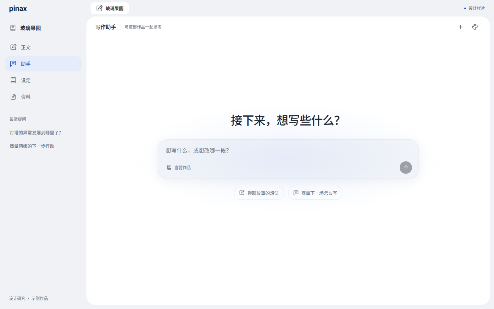
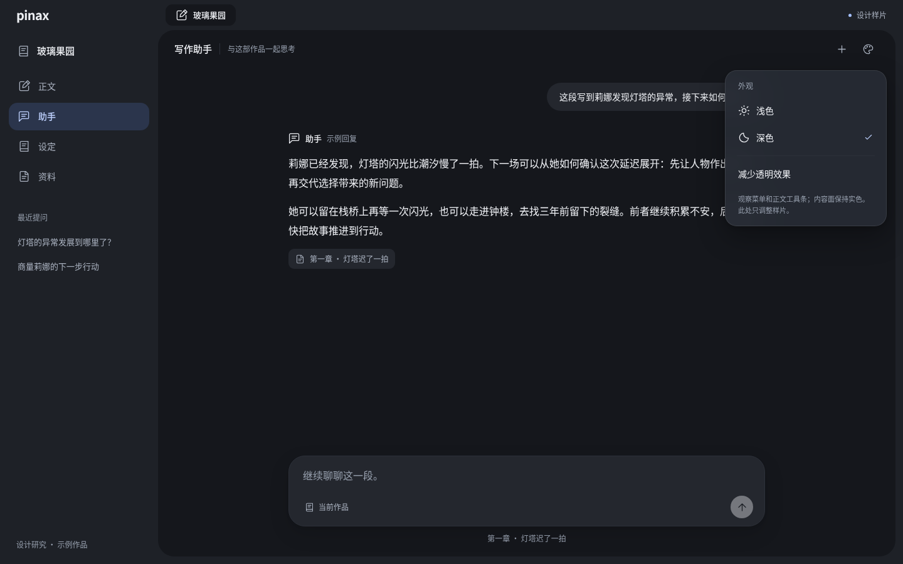
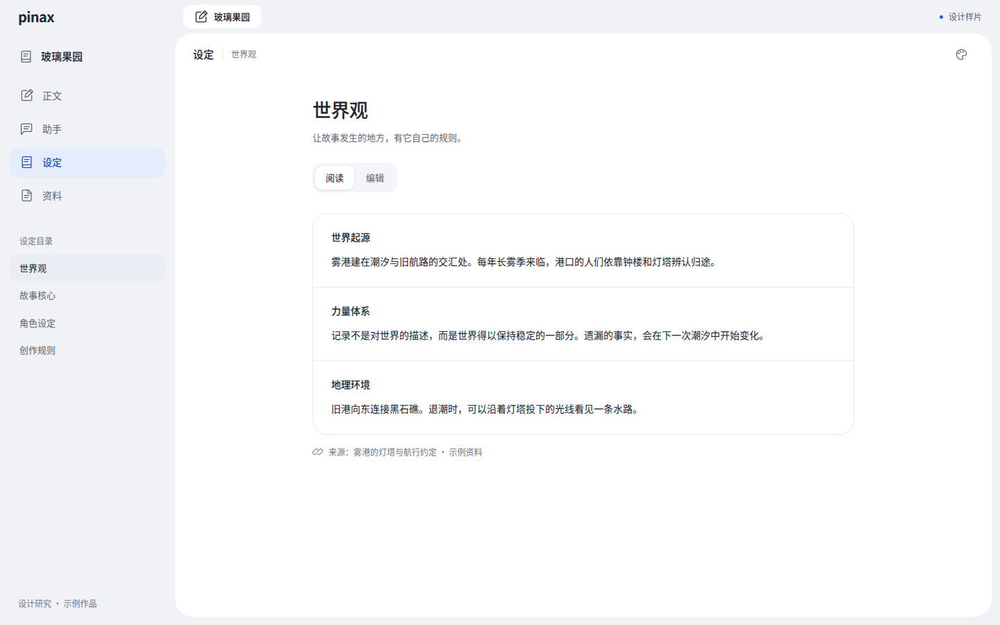
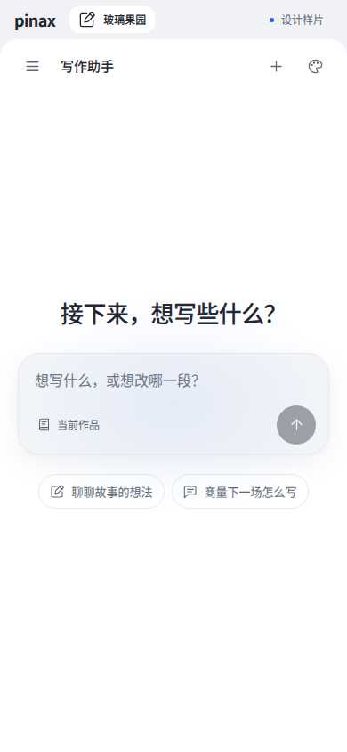

# Pinax 的 Google / iOS 质感改造研究

研究日期：2026-10-01。本文是设计方向与施工依据；配套交互样片独立于 Pinax，生产界面尚未按此方案改造。作者仍未认可上一轮的整体质感。

## 1. 建议的方向

把 **Google 的版面组织与色调层次、Apple 的功能层材质与交互反馈** 组织成一套适合长期写作的界面。内容有宽阔、稳定的阅读面；导航有固定位置和清楚分组；临时工具通过局部深度表达与内容的关系。助手空白页允许轻微的蓝色氛围，进入实际工作后把注意力交给文字。

作者给出的 Gemini 桌面截图是助手外观的最高参考。它的关键关系是：左侧列表较密，中央输入较疏；标题和输入共享轴线；蓝色光晕集中在空白输入附近。我们之前统一颜色、圆角、字体和控件，补好了基础，但对整屏比例、工具出现时机和切页连续性的处理仍不足。

### 本次可直接查看的样片

[打开独立交互样片](../design/google-ios-surface-study-20261001.html)。下载后可以直接用浏览器打开；它没有外部依赖，也不需要启动 Pinax。

可切换正文、助手、设定、资料；对照浅色、深色与减少透明效果；查看空白助手、输入、示例对话、菜单和资料预览；设定支持临时阅读/编辑切换。发送显示预置示例回复，编辑刷新后恢复。样片没有接模型、真实项目存储、正式编辑器或完整窗口管理。

这些图片用于比较设计方向，不代表生产功能交付，也不代表作者视觉确认。

## 2. 调研了什么，证据能说明什么

本轮分别研究 Google、Apple 和 Pinax 当前页面，并实际查看产品图。移动产品图只用于研究材料、分组和适配方法；桌面构图优先沿用作者的 Gemini 截图和 Docs 实图。

| 资料 | 本轮核对与实际观察 | 在 Pinax 中的用途 |
| --- | --- | --- |
| 作者提供的 Gemini 桌面截图 | 深灰侧栏、近黑主区、中心输入、局部蓝光与文本列表；只证明截图中的桌面状态 | 助手比例、侧栏分组、欢迎区气氛 |
| [Google Workspace 产品图](https://workspace.google.com/blog/product-announcements/reimagining-content-creation)，2026-03-10 | 实际查看 Docs 空白/正文和 Drive 图；密集工具共用低对比底面，文稿和文件行保持清楚 | 正文工具分组、资料列表、AI 入口依附现有工作面 |
| [Google Expressive 研究](https://design.google/library/expressive-material-design-google-research)、[Material 3 官方实现说明](https://developer.android.com/develop/ui/compose/designsystems/material3) | 颜色、形状、大小和运动共同建立注意层级；色彩按角色组织 | 层级、面层、状态与组件职责；不直接复制 Android 数值 |
| [Gemini 设计更新](https://blog.google/innovation-and-ai/products/gemini-app/next-evolution-gemini-app/)，2026-05-19 | 查看官方拼图及视频的两帧；公告介绍 Neural Expressive | 补充设计发展方向；不能当作作者桌面图的 CSS 或完整动态实测 |
| Apple 当前 [Materials](https://developer.apple.com/design/human-interface-guidelines/materials)、[Layout](https://developer.apple.com/design/human-interface-guidelines/layout)、[Typography](https://developer.apple.com/design/human-interface-guidelines/typography) | 实际查看材质、Landmarks、Mail 字级与大字重排图 | 功能层与阅读层分工、共同基线、文字角色与重排 |
| [WWDC25 设计系统](https://developer.apple.com/videos/play/wwdc2025/356/)、[当前 iOS 产品页](https://www.apple.com/os/ios/) | 阅读官方 transcript，查看当前 Safari 菜单和 Mail 动作组；当前页面强调对比度与折射一致性改善 | 圆角与密度关系、局部材质；2025 演示与当前产品分别标明 |

以上对 Pinax 的建议属于本次设计判断。官方研究结果与原生系统能力不能直接作为 Pinax 的效果保证。

两张有代表性的官方图：

Google Docs：观察工具整体与文稿的关系，以及下方 AI 输入如何依附内容。[图片所属官方说明](https://workspace.google.com/blog/product-announcements/reimagining-content-creation)

Apple Mail：观察三个动作共用一块材质，图标和文字所在的功能层有足够遮挡。[图片所属官方产品页](https://www.apple.com/os/ios/)

## 3. Pinax 目前差在哪里

以下根据当前本地实图和组件组织判断。静态图能说明布局关系，不能证明真实编辑有卡顿或跳动。

| 优先级 | 当前可见问题 | 改造重点 |
| --- | --- | --- |
| P0 | 作品页签、正文工具、跨页导航、右侧工具轨同时承担入口；设定页和手机页面又有另一套排布 | 分清已打开工作区、同书工作区、当前对象工具三种职责，让位置稳定 |
| P0 | 助手、正文、设定、素材的标题、内容宽度和辅助栏各自安排；换页时空间节奏变化明显 | 建立少量工作面模板，共用标题带和间距级差，按任务确定内容容量 |
| P1 | 导航选择、输入底色、工具分组和对话气泡深浅接近；大圆角面在不同页面连接方式不同 | 按用途定义面层边界、形状和连接方式，先处理整块工作面 |
| P1 | 空设定首先呈现重复 textarea 与逐项生成按钮；漫画页、素材页长期显露较多工具 | 根据空白、阅读、编辑、生成、审阅状态安排密度，保持常用动作可达 |
| P1 | 字体与颜色有统一基础，但作品名、主导航、条目、证据、状态还需要完整角色分工 | 检查真实中英文字形与基线；强调色的面积、形状随动作角色变化 |
| P1 | 手机顶部导航叠层较长；各页的滚动、固定栏和展开方式不同 | 为正文、对话、目录/详情、画布分别确定滚动所有者与手机优先级 |

现有偏好页的标签和值行、书封、作者正文字体可继续保留。新方案重点改工作区组织与控件外观。

## 4. 整体如何加入

### 4.1 先定共同的页面骨架

桌面保留多工作区页签。作品侧栏上部固定为书籍上下文及正文/助手/设定/资料，下部随当前工作区显示章节、会话、设定目录或资料索引。两组通过距离、文字角色和选择强度区分。侧栏不因局部功能重新建立另一套作品身份。

主区使用共同的标题位置与动作基线。正文的局部工具按编辑、辅助创作、视图分组；设定与资料的局部动作依附当前分区或文件。右栏承担当前对象的检查、候选或详情，关闭后保留对象和草稿。地图、条目等能力继续在设定工作区有清楚入口。

**跨页与同页工具可以同时保留，但必须表达用途。** “助手”页面入口打开完整会话；正文右栏的助手入口继续服务当前选区或章节。二者共享会话与输入，展示方式不应让作者误以为是两个助手。对重复入口的调整，需要逐项核对原来的任务路径。

手机将作品/对象目录收进可展开导航，标题与当前动作常驻。目录展开后可以切页、切对象，关闭恢复可见焦点；不能把桌面的每层导航逐行堆到正文之前。样片先展示这种优先级，正式版仍要接真实切书与窗口状态。

### 4.2 定义面层的用途

| 角色 | 外观关系 | 放置内容 |
| --- | --- | --- |
| 外壳与导航底 | 比内容面略灰；普通行透明，当前主入口用浅色调填充，局部条目选择更轻 | 页签、作品入口、章节/会话/资料索引 |
| 内容阅读面 | 稳定实色；连续展开，长文本有明确阅读宽度 | 正文、助手回答、来源原文、设定内容、画布内容 |
| 输入与检查区 | 轻微底色或一条边界；聚焦时只出现一个焦点边界 | 助手输入、设定字段、生成参数、右栏编辑 |
| 临时功能层 | 局部遮挡、细边缘、柔和投影；有背景内容经过时可用受约束的透明材质 | 菜单、选区动作条、资料预览控件、图像工具 |

Google 的色彩角色与 Apple 的功能层分工可以形成一致的空间关系。Apple HIG 将 Liquid Glass 用于导航与控制层，并明确限制在内容层使用；本方案据此让阅读内容保持实色。[Apple Materials](https://developer.apple.com/design/human-interface-guidelines/materials)

阴影用来说明悬浮与覆盖。正文和普通资料行主要靠版面、色调与间距建立关系；打开菜单或检查器时，才提高遮挡、边缘与投影强度。暗色重新设计明度和边界，使用自己的文字与选择色。

### 4.3 字体、颜色和形状一起安排

界面、助手回答和资料元信息采用完整的系统无衬线回退；作品正文、书封和导出继续沿用作者自己的排版。需要在 Windows、macOS 与手机上核对实际中文字体和中英基线，Linux 截图只能证明当前环境。

文字角色限制在导航、条目、组标题、工作区标题、内容正文、元信息几类。本方案先试排常规文字 400、当前项与重要动作 500；大标题只用于真正承担焦点的区域。小号状态文字仍须清楚可读，大字时重排标题、元信息与动作。字重数值是 Pinax 草案，文字层级与重排原则参考 [Apple Typography](https://developer.apple.com/design/human-interface-guidelines/typography)。

当前工作入口使用轻微色调填充，章节与会话选择采用更轻的中性底；鲜明蓝色用于主动作、链接、键盘焦点及确需强调的候选，通过面积和形状区分这些角色。待确认、失败、已保存同时有文字或图形提示。书架与插画主要由作品内容提供颜色，工具保持安静。

形状随用途变化：大输入区柔和，主要动作可用胶囊；密集桌面工具与列表采用紧凑圆角；稿页、漫画格保持内容几何。嵌套区域把外圆角、内圆角和内边距一起检查。Apple 的桌面设计说明也保留了密集检查器中的圆角矩形。[WWDC25 设计系统](https://developer.apple.com/videos/play/wwdc2025/356/)

### 4.4 动效说明关系

只对确有状态变化的区域安排短反馈：侧栏展开、菜单出现、来源预览、候选进入、采用完成。动作的方向与入口位置一致；用户可以立即继续操作或关闭，动画不得成为等待条件。输入、光标、正文行距与高频保存保持稳定。[Apple Motion](https://developer.apple.com/design/human-interface-guidelines/motion)

可区分两种强度：反复使用的编辑反馈克制；空白欢迎和重要任务完成可以有少量表达。Google 的 MotionScheme 也区分实用的 standard 与较突出的 expressive；这里继承角色分工，具体 Web 参数由 Pinax 试排。[Google MotionScheme](https://developer.android.com/reference/kotlin/androidx/compose/material3/MotionScheme)

## 5. 各页面具体怎么改

| 页面 | 第一眼的焦点 | 具体加入方式 |
| --- | --- | --- |
| 助手空白页 | 一个故事输入入口 | 标题、宽输入与两项真实写作起点共用中心轴线；参考图的轻蓝光局限在输入周围；工具依附输入区 |
| 助手长对话 | 回答与下一次输入 | 回答和输入共用阅读列；主对话保持一个滚动区域；较长的来源/工具结果折叠，详情按需展开；生成/停止/重试尺寸稳定 |
| 正文 | 文稿与当前落笔处 | 保留作者阅读宽度和字体；顶部工具成组；选区动作就近出现且不占段落高度；右栏显示审阅、推演或对象详情 |
| 设定 | 本节内容和当前字段 | 空白时一个清楚起点；有内容时减少重复空框；直接手动编辑仍可达；字段动作随编辑出现；候选与正式内容清楚分开 |
| 资料 | 文件、处理状态与原文 | 以清楚的列表或目录组织文件；详情展开查看原文/证据/结果；导入中与失败有明确状态；信息密度随内容量变化 |
| 素材、速记 | 当前文字或素材 | 工具围绕所选内容，辅助栏有内容时展开；纯文字速记保留标题和编辑能力；来源与正文回程采用共同样式 |
| 漫画、插画、画布 | 图像或空间内容 | 主画面充分展开；页级、构图级、当前格的工具分别成组；图片模型闭合态与选择器一致；高级参数渐进展开，停止和重试始终可达 |
| 书架、偏好 | 作品或当前选项 | 保留封面与行布局；继续打磨文字基线、元信息、菜单与空态；少量作品时允许合理留白 |

设定样片增加阅读/编辑模式只用于比较“内容”和“输入”的密度。正式版是否增加模式，应结合当前直接编辑路径决定；不能因样片有按钮就自动新增产品流程。类似地，正文样片的三个简化工具仅用于展示材质，正式工具集仍须逐项承接。

## 6. 如何落到现有 Vue 代码

采用现有导航、字体与主题基础，先明确共同视觉职责，再替换对应旧覆盖规则。后续施工每个切片同时处理该组件的亮暗、悬停、焦点、选择、禁用和展开状态。

| 现有 owner | 后续工作 |
| --- | --- |
| `AppShell.vue`、`WorkspaceTabs.vue` | 保留多工作区与关闭/回程状态，协调共同外壳、页签和主面连接 |
| `ProjectWritingNavigation.vue`、`SettingsWorkspaceHeader.vue`、`SettingsSectionNav.vue` | 统一作品导航位置与局部导航职责，减少换页后的结构变化 |
| `themes/legacy.css`、`workspace-surfaces.css`、`workbench-controls.css` | 收口语义色、面层、形状、反馈参数；替换命中的旧规则，避免继续叠加高权重覆盖 |
| `AuthoringAssistantWorkspace.vue`、`AuthoringKnowledgeAssistant.vue`、`Authoring.assistant.css` | 助手空态、长回答、来源和输入共同构图；完整页与侧栏共用状态 |
| 正文工具组件及 `Authoring.block-native.css` | 工具分组、选区功能层、滚动边界；保留编辑器/批注/推演的所有权 |
| 设定字段、资料、媒体组件 | 按真实工作状态调整密度与检查器，使用共同浮层与状态样式 |

建议新增或收口的语义角色为 `surface-navigation`、`surface-content`、`surface-input`、`surface-overlay`、`selection-primary`、`selection-secondary`、`focus-ring`、`motion-feedback`、`motion-reveal`。这是职责草案，最终命名尽量映射现有 token，避免同时维护两套同义变量。

### 试排值与浏览器边界

样片的数值只代表一个可比较的 Pinax 方案：桌面导航约 252px，普通控件 36px，手机点击区 44 CSS px；大工作面 26px 圆角，输入 26px，菜单 19px；快速反馈约 120ms，展开约 220ms。后续看整屏与真实内容再决定。Apple 的 pt、Android 的 dp 与 Web CSS px 是不同单位。

Web 可以用半透明底色、`backdrop-filter`、局部边缘和阴影近似部分材质，但无法由一条 CSS 自动获得原生 Liquid Glass 的折射、背景适应、触感和系统联动。模糊只有在有可见背景且填充部分透明时才有意义；层叠与 backdrop root 也会影响结果。[MDN backdrop-filter](https://developer.mozilla.org/en-US/docs/Web/CSS/Reference/Properties/backdrop-filter)

材质先使用清楚的默认填充；浏览器不支持或减少效果时使用实色。`prefers-reduced-transparency` 的支持仍有限，因此正式版若加入材质，需要在现有外观设置中提供可用的减少效果选项；运动遵循 `prefers-reduced-motion`。[MDN 减少透明效果](https://developer.mozilla.org/en-US/docs/Web/CSS/Reference/At-rules/%40media/prefers-reduced-transparency)、[MDN 减少动态效果](https://developer.mozilla.org/en-US/docs/Web/CSS/Reference/At-rules/%40media/prefers-reduced-motion)

实现时限定模糊范围，避免嵌套或持续动画滤镜；在真实手机 Safari 和 Chromium 上测量滚动与合成开销，再选择参数。本轮没有进行原生真机、性能或完整兼容性验收。

## 7. 实施顺序与每片出口

| 顺序 | 切片 | 可审阅的出口 |
| --- | --- | --- |
| 1 | 共同外壳、作品侧栏、正文/助手内容关系 | 同书四个工作区的亮暗整屏、手机导航；真实页签和切书行为保留 |
| 2 | 助手空白、长对话、来源与输入 | 输入自增长、生成/停止/错误、阅读中段、来源展开/返回；图片对照样片和作者参考 |
| 3 | 正文工具、选区层、右栏 | 文稿持续编辑、批注、推演、候选采用/撤销；段落间距、光标和阅读位置稳定 |
| 4 | 设定与资料 | 空白/已填内容/编辑/导入/候选/失败六类状态；书籍归属、来源与保存边界保留 |
| 5 | 漫画、插画、素材、画布与其余页面 | 当前对象与草稿保留；生成参数、预览、缩放、导出和正文插入按现有能力接通 |

先比较代表性区域再扩展。已有工程门禁不能替代视觉判断。`Authoring.vue` 当前已在结构预算上限，后续 UI 工作放在已有子组件或独立组件中，不继续增加根页面体积。

### 视觉与行为的审阅条件

- 同一作品切换正文、助手、设定、资料时，作者能看见相同作品上下文；导航职责和标题基线连续。
- 空白助手只有一个明确输入焦点；长回答、引用和生成状态出现后，阅读层级仍成立。
- 普通、悬停、按下、键盘焦点、选择各有清楚反馈；待采用、失败、保存等业务状态有可理解文字。
- 正文选区工具不挤开段落；打开和关闭右栏后，光标、选区、批注位置和草稿仍归原对象。
- 手机优先展示内容与当前动作；隐藏目录无法获得键盘焦点；软键盘与动态浏览器栏下发送、停止和关闭可达。
- 1440/1024/390/320px、亮暗、中英长标题和大字分别对照真实内容；漫画画布尺寸、缩放和导出不随 UI 装饰变化。
- 减少透明效果、减少动态效果与高对比度模式下仍能明确操作。大面积文字靠可读性和编排建立质感。

## 8. 本轮交付与限制

交付这份研究和一个独立交互样片，并保留代表截图。正式 Pinax 的导航、编辑器、模型、存储和媒体运行链本轮没有修改。

样片在离线 Chromium 中查看了 1440×900、390×844、320×720 的亮暗页面、输入、对话与菜单；几何与控制台观察无整页横向溢出或 pageerror。补有设定阅读/编辑、资料预览、浮层与焦点观察。它用于发现设计和样片的问题，不能替代正式功能验证、真机键盘体验或作者审美判断。

过程与本轮检查见[界面研究回执](../agent-runs/google-ios-ui-20261001.md#详细研究与独立交互样片)。下一轮从第一个代表切片接入；整体方向仍由作者看样片确认。
