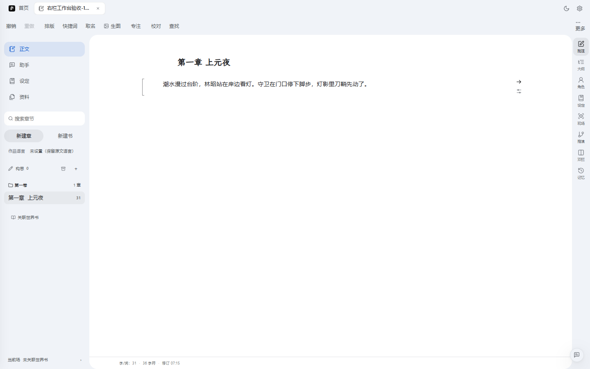
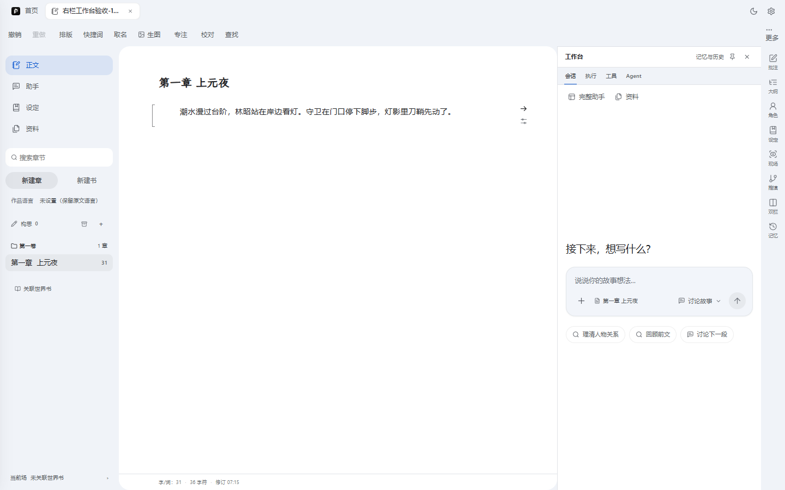
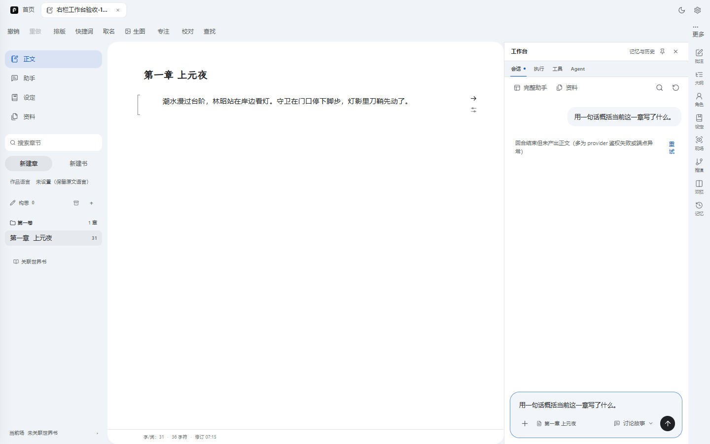
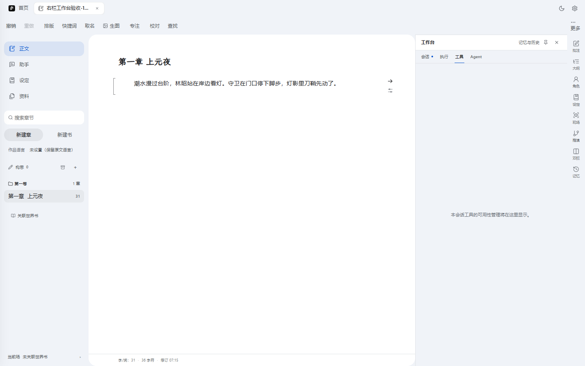
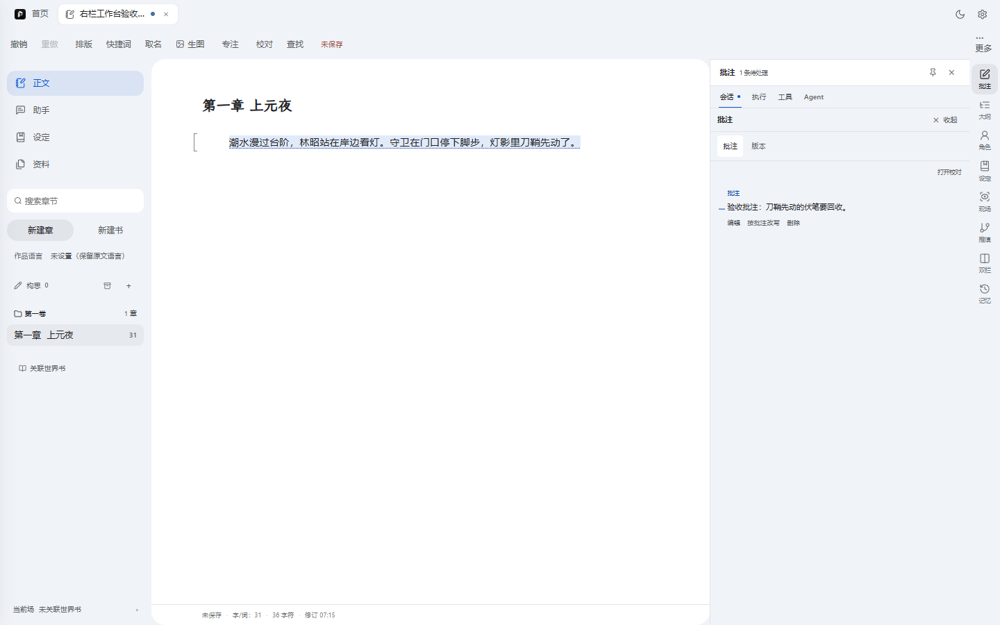
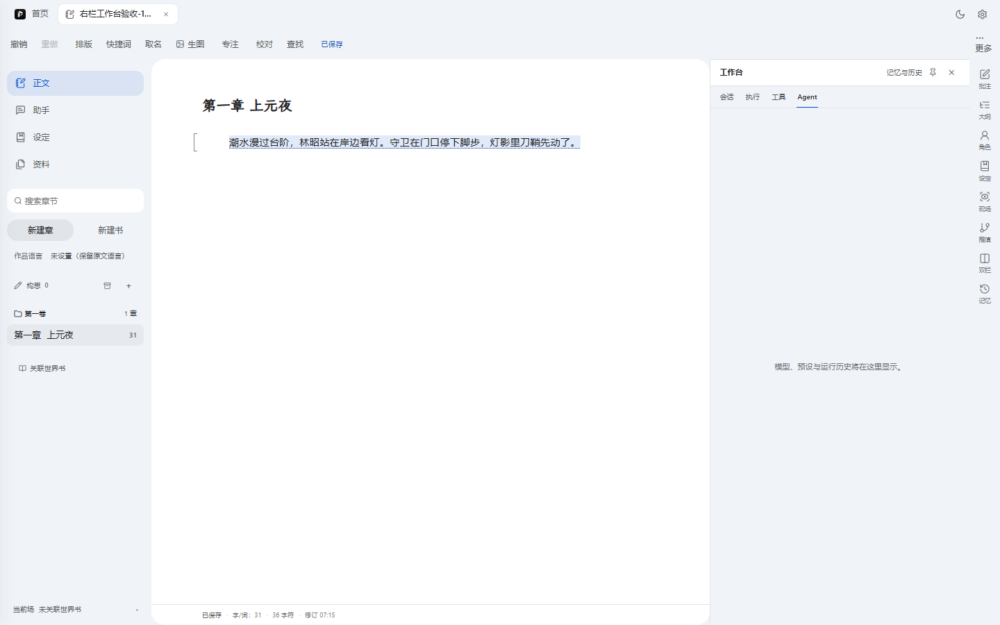
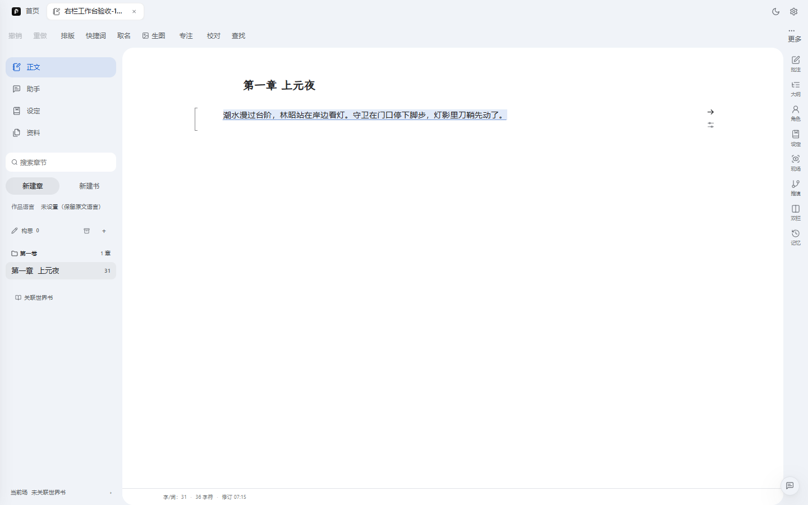
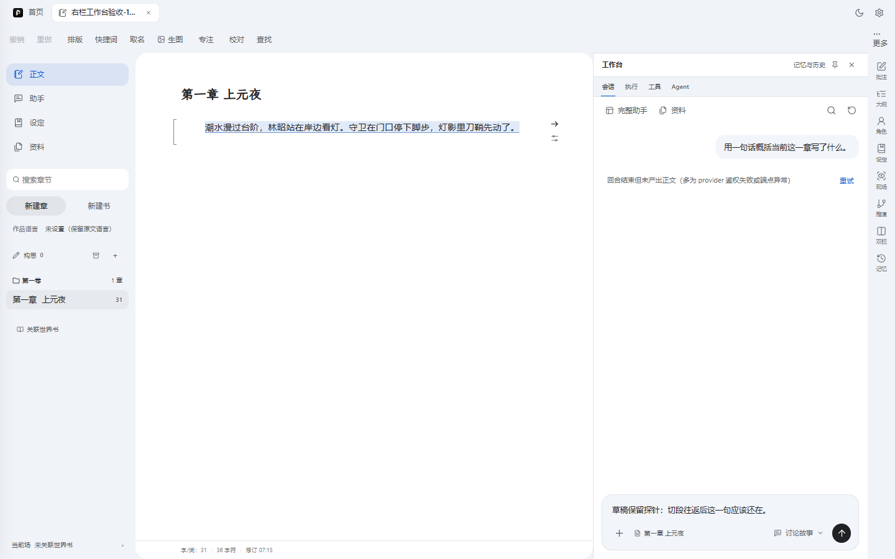
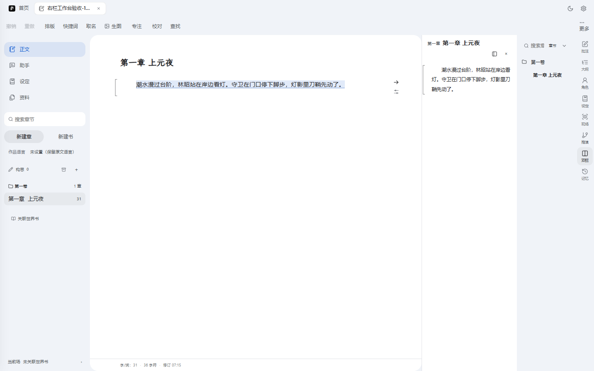
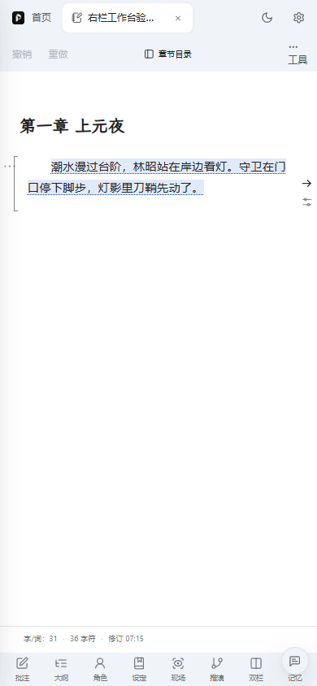

# 右侧常驻工作台（dock）P1 效果实拍验收 — 2026-10-08

> 交付分支 `feat/agent-unification-p0`（P1 主提交 `7f919ba` + 验收中修复）。采集方式：隔离栈（`PORT=3012` 独立 server 进程，复用 8451 kit 任务面）+ Playwright headless（Edge channel）真实用户流造数，全部截图为真实运行画面，无摆拍。结构断言 **12/12 PASS**（采集脚本内建），另有两张修复后重采。配套：[assistant-host-rightdock-20261008.md](./assistant-host-rightdock-20261008.md)（P1 方案）、[rightdock-prd-20261008.md](./rightdock-prd-20261008.md)（总 PRD）。

## 效果总览

写作页右侧由「九选一互斥检查器」升级为**常驻四段工作台**：会话（助手，永不卸载）/ 执行 / 工具 / Agent 四段 tab；原九个工具变成 dock 上的临时面板；收起后右下角徽标带未读点重开；宽度可拖（360–520）并落盘记忆。切段不再卸载任何东西——探针实证草稿、未读、回答在切段往返后逐字保留。

## 逐节实拍

### 1. 真实写路径：建项目 → 建章 → 输入正文



真实点击流建的书。落盘证据见下文「磁盘实拍」：`正文\001-第一章 上元夜.md` 与修订史 `currentText` 逐字含输入句子，`source: "manual-save"`。

### 2. dock 会话段（缺省视图）



工作台 header（记忆与历史 / 固定 / 关闭）+ 四段 tab + 助手空态与输入区。工具轨已 9→8（无助手格）。初始收起态由右下角徽标进入。

### 3. 真实提问（渠道现状如实）



提问提交后命中**已知服务端问题**（漏斗/agent-loop 段空 completions，kit 直连 dots 正常——在途 WIP 域，非 dock 问题）。失败态 UI（可读错误 + 重试钮）与**会话 tab 未读红点**如实呈现。

### 4. 草稿切段往返保留（断流根治的 UI 态证据）




输入草稿 → 切「工具」tab → 切回会话：草稿逐字还在（会话段 v-show 永不卸载）。

### 5. 工具临时面板 overlay + 真实建边注



点工具轨「批注」→ dock 内开临时面板（带「收起」回会话）；选区建边注成功，dock header 出现「1 条待处理」。

### 6. 执行 / Agent 占位段




P1 仅骨架，两段为占位空态（P3 执行日志 / P5 Agent 段落地）。overlay 开着时点任何 tab 会先收面板——这是验收中抓到并修复的缺陷（见「已知瑕疵」#2）。

### 7. 拖宽 + 偏好落盘


dock 左缘拖宽 360–520，落 `writing_dock_preferences_v1`；reload 重开宽度保持。**注意**：应用有 85% 界面缩放，屏幕像素 = 设定值 × 0.85（520 → 442 屏显），偏好存的是缩放前 CSS 像素。

### 8. 收起徽标 + 重开直达会话段




关闭 dock 后徽标出现在右下角；点徽标不再落回上次的面板，直达会话段（验收中修复的第二个缺陷）。

### 9. dual 让位



双栏的面板本体在正文区，dock 整体让位（复刻原 aside 的互斥语义），不再拦截点击。

### 10. 390 移动端




窄屏 dock 变全幅 sheet（会话/工具面板同构），收起后徽标可命中、不被底部工具条遮挡。

## 磁盘实拍

真实保存后项目文件夹（清理前取证）：

```text
右栏工作台验收-1791414905481/
├── .pinax/project.json (244 B)
├── meta.json (303 B)
├── 世界书/
├── 大纲/ (outline.json 33 B、大纲.md 51 B)
├── 日志/修订史/第一章 上元夜.json (971 B)、记忆台账.json
├── 构思/
├── 正文/001-第一章 上元夜.md (107 B)
└── 资料/
```

`.pinax/project.json`（marker，注册表 `pinax-project@1` 之锚）：

```json
{
  "schemaVersion": 1,
  "spec": "pinax-project@1",
  "projectId": "proj_muyq6liyd697",
  "name": "右栏工作台验收-1791414905481",
  "kind": "novel"
}
```

修订史（真实写路径的直接证据——输入句逐字落盘，`source: manual-save`）：

```json
{
  "chapterTitle": "第一章 上元夜",
  "blockHistory": [{
    "currentText": "潮水漫过台阶，林昭站在岸边看灯。守卫在门口停下脚步，灯影里刀鞘先动了。",
    "toDocumentRevision": 35,
    "source": "manual-save"
  }]
}
```

宽度偏好（reload 保持的证据）：

```json
writing_dock_preferences_v1 = {"width":520}
```

## 已知瑕疵（如实）

1. **助手提问当前返回失败态**（截图 03）：`/api/advisor/task` 空 completions（500）。kit 任务面直连 dots 正常出活，故障在漏斗/agent-loop 段——在途 WIP（chat.js / kitModelGateway 等）域，**非 dock 问题**，失败态 UI 本身工作正常（可读错误 + 重试）。
2. **验收中抓到并已修复的缺陷**：overlay 开着点「执行/Agent」tab，高亮切换但内容仍被面板盖住。修复：任何段 tab 点击先收面板（`selectTab`），重采截图 07/08 确认。
3. 同一验收批次修复：徽标重开原先落回上次工具面板，现直达会话段（截图 12）。
4. 执行/工具/Agent 三段是占位空态——P3（执行日志）/ P4（工具管理）/ P5（Agent 段）落地。
5. 85% 界面缩放下的屏显宽度 = 设定值 × 0.85（缩放功能语义；偏好存 CSS 像素）。
6. 拖宽范围 clamp 360–520；设定 catalog 加宽列（520–600）不参与拖宽。
7. 存量（非本线引入）：`f2-knowledge-assistant-check` 自 PR#5 起断言过期、`rehearsal-panel-check` 缺 `authoring.rehearsal.step` mock fixture、`settingsAgentWorkflows` 全量并行偶发抖动（单跑 7/7）。
8. 验收门禁快照：vitest 198/200（2 红同开工基线）、`Authoring.vue` 10590/125、Authoring chunk 1,397,800 ≤ 1,450,000、lint:delta 0 新增、循环依赖 4 条存量、SSE 切段连续性探针 14/14。

## 复现方式

```bash
# 隔离栈（避开在途 3001；复用 8451 kit 任务面）
PORT=3012 node server/index.js
# 采集（真实用户流 + 15 张截图 + 证据 JSON）
node scripts/tmp-rightdock-p1-capture.mjs
# 自包含 HTML（本 md 同目录同名 .html，截图 base64 内嵌）
node "C:/Users/Administrator/.agents/skills/effect-showcase/scripts/md-to-selfcontained-html.mjs" . docs/plan/rightdock-p1-showcase-20261008.md
# 结构门禁
node scripts/architecture/structure-budget-check.mjs
npm run test:run
```

采集脚本：`scripts/tmp-rightdock-p1-capture.mjs`（tmp- 前缀，正式化或移除待作者令）。探针建书与注册表条目已全部清理。
