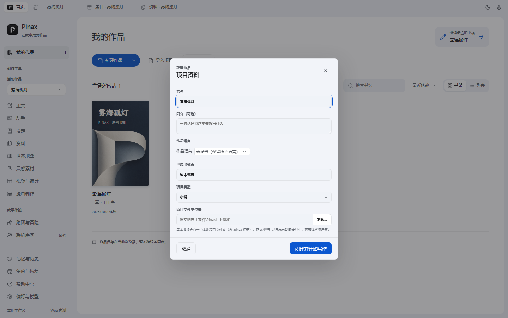
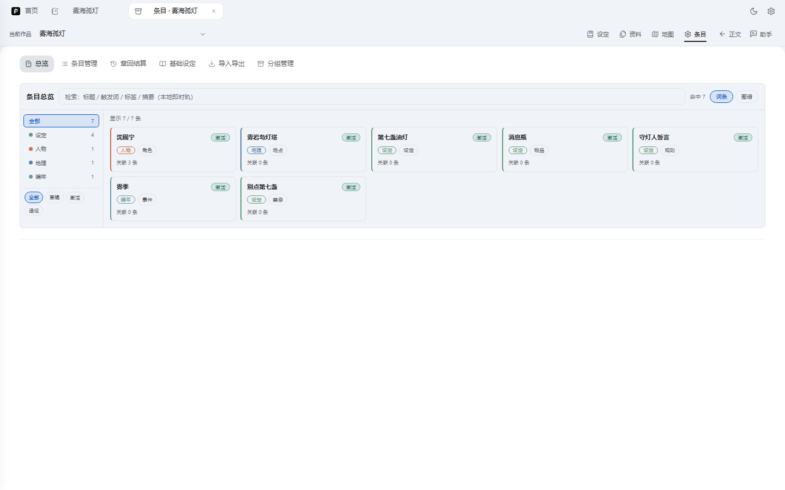
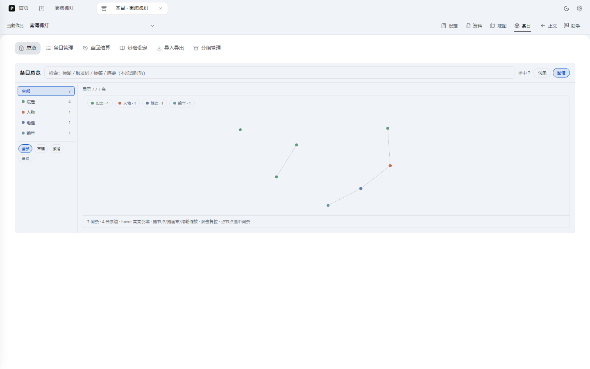
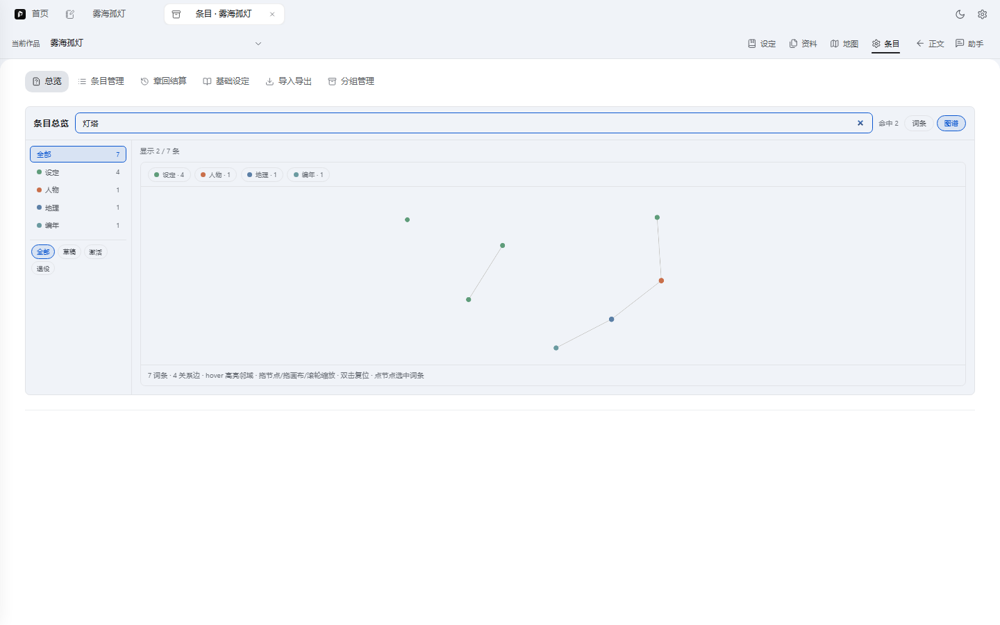
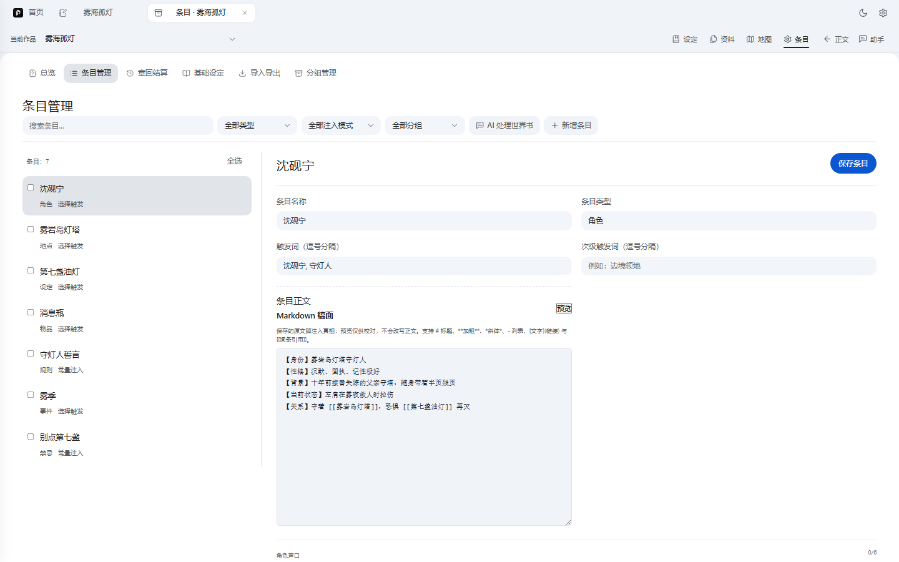
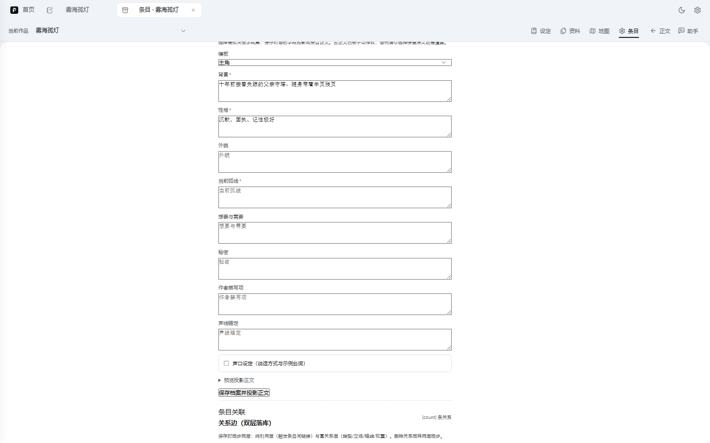
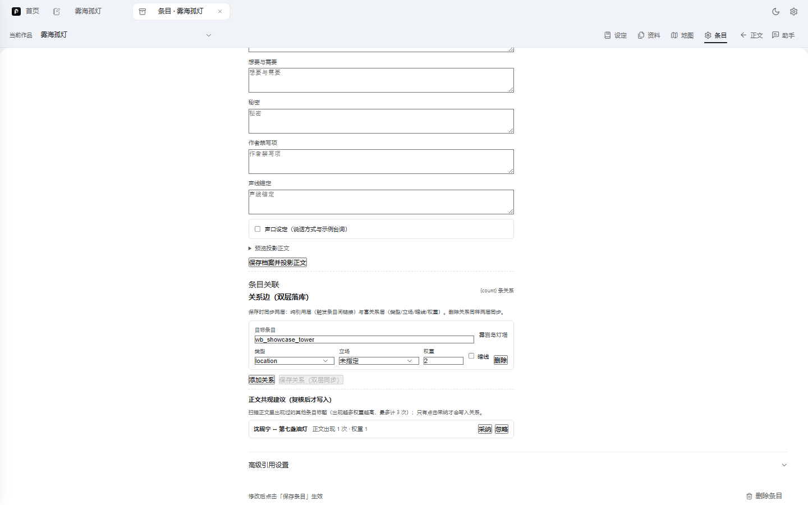
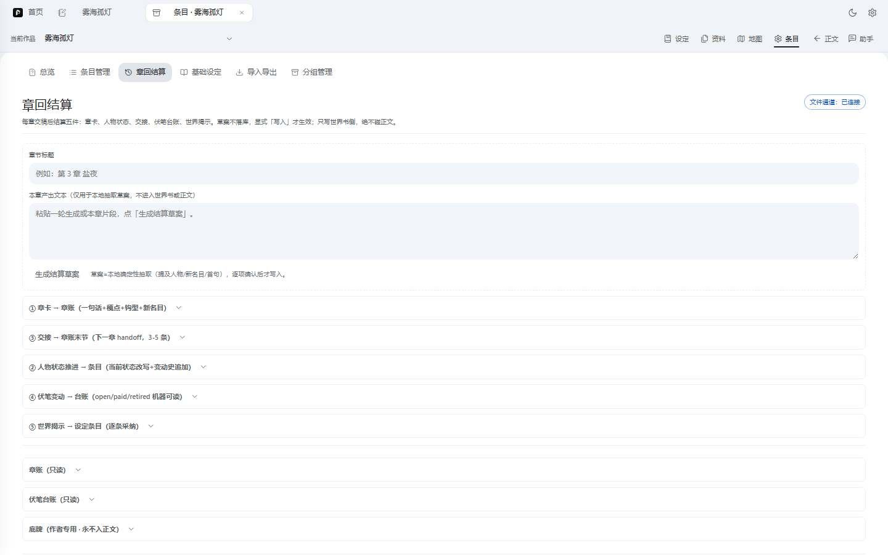
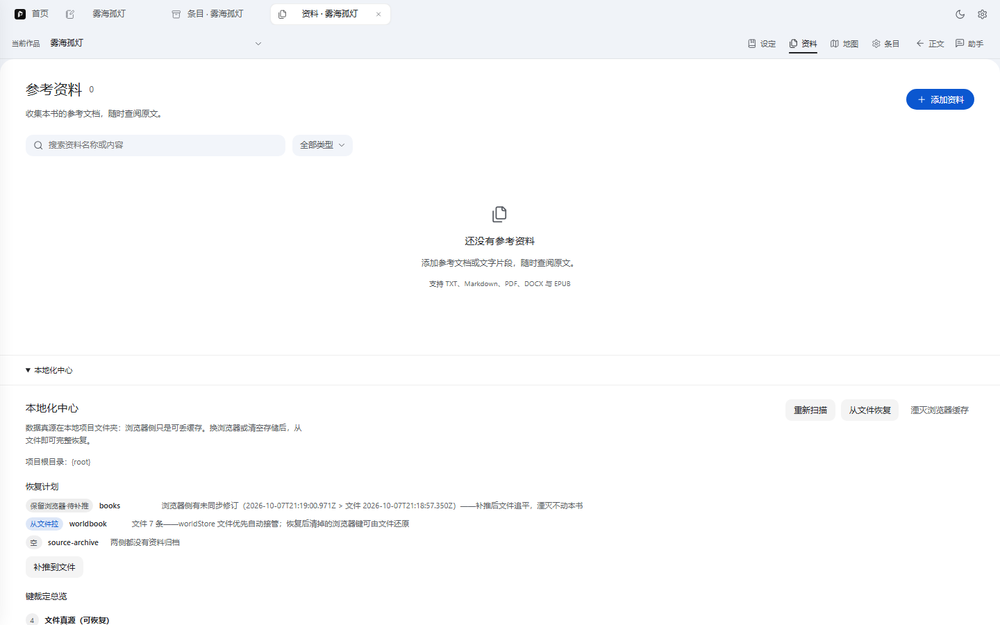

# 世界书统一化 · 效果实拍（2026-10-08）

本文是 [worldbook-unification-abc-20261008.md](./worldbook-unification-abc-20261008.md)（ABC 工单）的**效果验收文档**：全部截图来自集成栈真实运行画面（worktree `D:\pinax-wb-integration`，vite 5175 → server 3011，Playwright 无头浏览器按真实用户流操作采集），演示书《雾海孤灯》从新建到世界书落盘的全过程。

## 1. 从建书开始：本地项目自动绑定

新建作品时路径留空，自动在 `Documents\Pinax\雾海孤灯` 创建本地项目文件夹（`.pinax` 标记 + 注册表绑定）——这是 A/C 组"文件真源"的地基。



## 2. 条目总览（B1 统一浏览器）：一屏四件事

世界书编辑器新增「总览」首屏：左**分类树带计数**（设定 4 / 人物 1 / 地点 1 / 编年 1——编年是章账所在域）、中**卡片墙**（真实条目名 + 类型/分组徽章 + 激活状态徽标）、顶部**检索**（标题/触发词/标签/摘要本地即时轨，kit 同款打分）、右上**词条/图谱**切换。



**关系图谱**（Canvas 2D 力导向，零依赖）：7 词条 · 4 关系边，分类配色图例，hover 高亮邻域、拖节点/缩放、点节点选中词条。



检索即时过滤（"灯塔"命中 雾岩岛灯塔/守灯人 等）：



## 3. 条目编辑面（W3）：md 正文 + 模板档案 + 双层关系

点卡片进入条目管理。**md 编辑器**（等宽稿面，注入真相=保存的原文）+ **profile 七模板**（主角模板字段集：背景*/性格*/外貌/当前弧线*/想要与需要/秘密/作者禁写项/声线锚定，声口设定横切可开）：



**档案编辑区**（模板字段集 + 显式「保存档案并投影正文」，覆盖原文需作者二选一）：



**条目关联 · 双层库**：富关系边（目标条目带四级兜底解析 chip「雾岩岛灯塔」、类型/立场/权重/暗线）+ **正文共现建议**（"沈砚宁 → 第七盏油灯　正文出现 1 次 · 权重 1"，**采纳后才写入**，不做隐形闸）：



## 4. 章回结算（W5）：世界书随写作滚动更新

kit 章回结算五件落进产品：章卡→章账、人物状态推进（当前状态改写+变动史追加）、交接（下一章 handoff）、伏笔台账（open/paid/retired 机器可读）、世界揭示。**草案本地确定性抽取 → 逐项确认 → 显式「写入」才生效；只写世界书侧，绝不碰正文**。右上「文件通道 · 已连接」= A3 双写状态徽标；底牌（作者专用·永不入正文）有只读视图与注入排除回归。



## 5. 本地化中心（W6/C 组）：浏览器缓存湮灭

设置 → 资料页底部。数据真源在项目文件夹，浏览器侧只是可丢缓存：**恢复计划**（books 待补推/worldbook 从文件拉/source-archive 逐域展示，冲突 file-first + revision 仲裁）、**键裁定总览**（23 键三类：文件真源 4 / 可丢缓存 7 / 仅浏览器 12——模型 key 等安全敏感项永不上盘）、**湮灭浏览器缓存**（两步确认）后刷新，全部状态自文件还原。



## 6. 文件真源实拍：磁盘上的世界书

编辑保存后（A3 双写），项目文件夹内的世界书即 kit 体系标准布局——`纪律.md`/`伏笔/台账.md`/`底牌/暗线底牌.md`/`编年/章账.md` 骨架件 + **cat 目录即分类**（人物/地理/编年/设定…）+ `index.json`（RAG 指针账本）+ `graph.json`（worldbook-graph@1，kit 索引器同构）：

```
雾海孤灯/世界书/
├── graph.json / index.json / manifest.json
├── 纪律.md
├── 人物/沈砚宁.md
├── 地理/雾岩岛灯塔.md
├── 编年/章账.md · 雾季.md
├── 设定/第七盏油灯.md · 守灯人誓言.md · 消息瓶.md · 别点第七盏.md
├── 伏笔/台账.md
└── 底牌/暗线底牌.md
```

`人物/沈砚宁.md` 全文（frontmatter=agent 友好元数据，正文=注入真相，`[[id]]` 交叉链接保留）：

```markdown
---
schemaVersion: 1
id: wb_showcase_shen
title: 沈砚宁
name: 沈砚宁
kind: character
status: active
links: [wb_showcase_tower]
cat: [人物]
keys: [沈砚宁, 守灯人]
relations:
  - to: wb_showcase_tower
    type: location
    weight: 2
    src: entry
injection:
  mode: selective
  probability: 100
profile: {}
group: 角色
---
【身份】雾岩岛灯塔守灯人
【性格】沉默、固执、记性极好
【背景】十年前接替失踪的父亲守塔，随身带着半页残页
【当前状态】左肩在雾夜救人时拉伤
【关系】守着 [[雾岩岛灯塔]]，恐惧 [[第七盏油灯]] 再灭
【备注】结算演示：本章确认第七盏异常。
```

`graph.json` 首节点（kit `worldbook_index.py` 同构，可直接被 kit 工具索引/检索）：

```json
{ "format": "worldbook-graph@1", "project": "雾海孤灯世界书",
  "entries": [ { "id": "wb_showcase_shen", "cat": "人物", "title": "沈砚宁",
  "status": "active", "links": ["wb_showcase_tower"], "summary": "…" } ] }
```

## 7. 已知小瑕疵（下一波打磨）

1. 关系编辑器头部「{count} 条关系」等个别 53 键之外的漏登记键（总览卡片墙/图谱的占位符已在本轮登记修复）。
2. 关系边类型下拉显示原始值 `location`（应为「地点归属」中文标签）。
3. 本地化中心「项目根目录」显示 `{root}` 占位符未插值。
4. C4 双浏览器真机验收待做（集成栈与主工作区 3001 在途服务冲突，需排期切换）。

## 8. 复现方式

```bash
cd D:\pinax-wb-integration
PORT=3011 node server/index.js            # 终端 1
PINAX_DEV_BACKEND_ORIGIN=http://127.0.0.1:3011 npx vite --port 5175   # 终端 2
# 浏览器打开 http://localhost:5175 （或重跑采集脚本）
node scripts/tmp-worldbook-showcase-capture2.mjs
```
