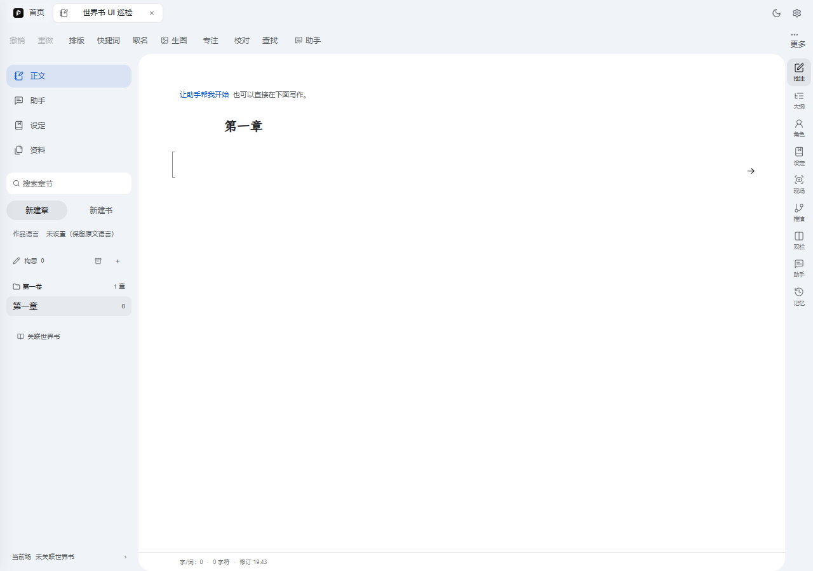
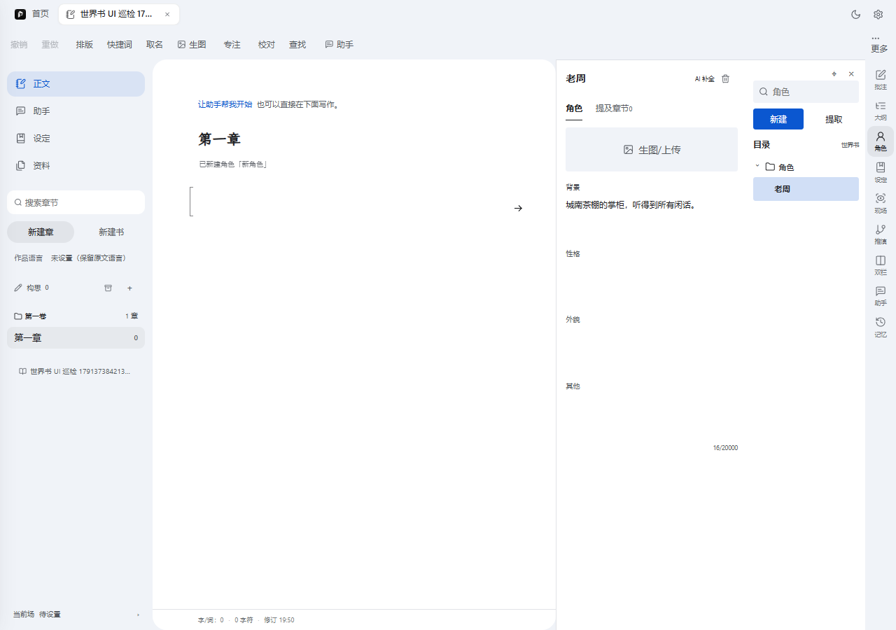
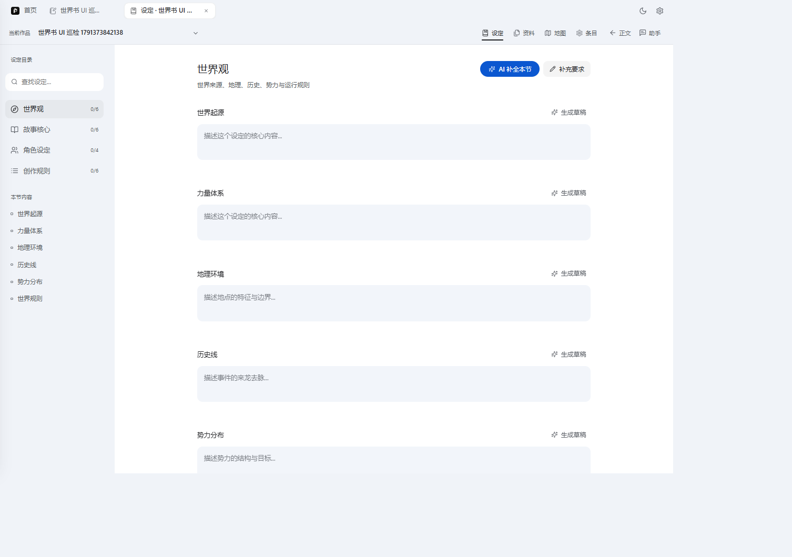
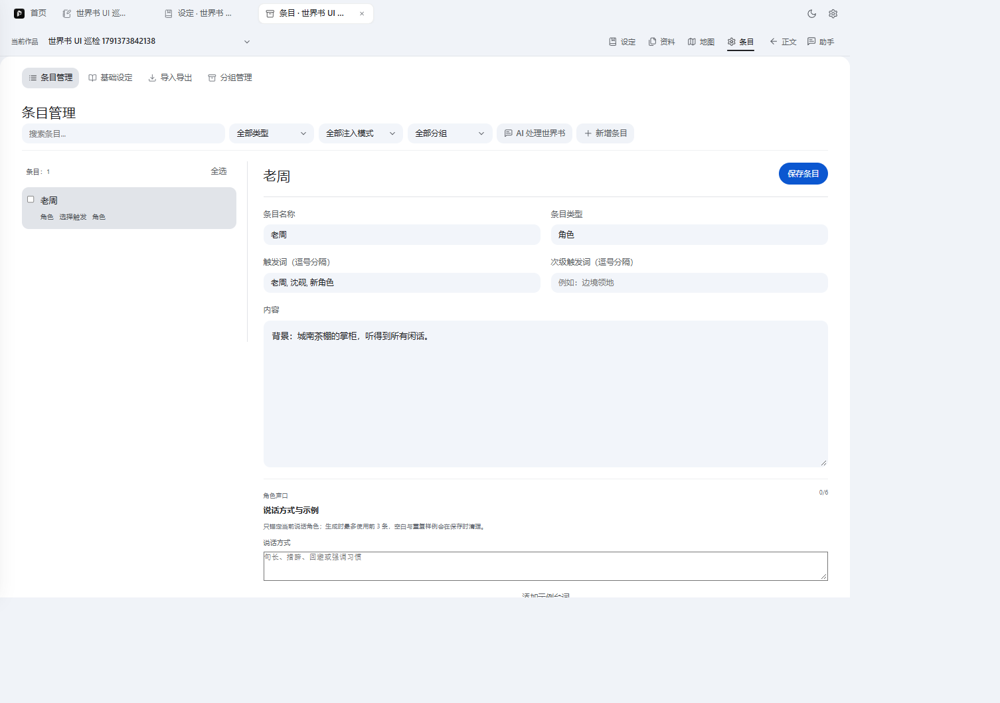
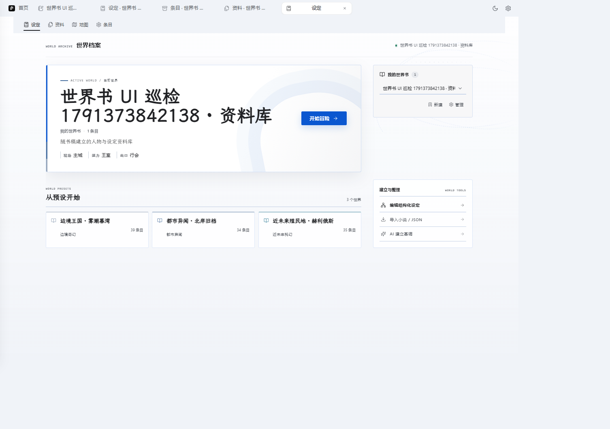
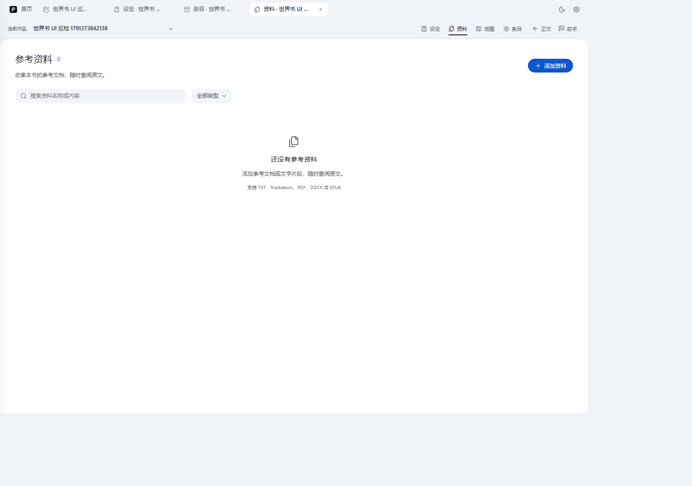

# 世界书 UI 现状巡检（2026-10-07）

结论先行：**「角色不是卡片」这句话在界面上有三处实证**。角色在编辑层是四个写死的文本框，在设定层是 `0/4` 的固定槽位，在世界书条目层被压扁成一段 `背景：……` 的纯文本。次要角色、NPC、路人拿不到和主角同一套容器，所以没法统一挂触发词、声口、层级。

巡检环境：本机 `http://localhost:3001`（express 起 `dist/`），Playwright + Edge headless，新建一本测试书「世界书 UI 巡检」，在 Authoring 角色工作台里建了一个人物后逐页截图。

> 截图放在 [`docs/screenshots/worldbook-ui-20261007/`](../screenshots/worldbook-ui-20261007/)，用相对路径引用，桌面端阅读。手机端查看器既不解析本地相对路径，也吃不下超长 base64 内联图，所以这份文档以文字结论为主，手机上直接读各节文字即可。

---

## 1. 创作台（Authoring）全貌

左侧章节书架、中间正文、右侧可折叠工作台。世界书相关的入口在这里有三个：右侧活动栏的「角色」「设定」，和顶栏的「设定 / 资料 / 地图 / 条目」四页（进入后见 §5、§6）。

## 2. 角色工作台 = 固定四框

这就是「固定设计」的本体：一个名字输入框 + 头像位 + **背景 / 性格 / 外貌 / 其他** 四个 textarea（`0/20000` 是四框合计字数），右侧目录只有一个「角色」文件夹。次要角色和主角拿到的是同一张空表，但也仅仅是同一张空表——**没有层级、没有分类、没有和正文的绑定关系**，只有「提及章节」这一个只读 tab。

代码位置：`src/components/authoring/AuthoringCharacterPanel.vue:241-242` 渲染四个框；`src/services/characterCard.js:3-17` 定义 13 个可解析标签，`:140-152` 把落不进这四框的 7 个字段折叠成 `other` 文本，`:132` 列表视图 `.slice(0, 4)` 只显示前四项。

## 3. 设定页：角色被记成 `0/4` 的额度

左侧设定目录把四节全写成固定槽位计数：世界观 `0/6`、故事核心 `0/6`、**角色设定 `0/4`**、创作规则 `0/6`。角色设定这一节在数据结构层就是 `characters.protagonists / majorSupporting / npcs` 三个 textarea 字符串（`shared/structuredSettingContract.js:38-41`），schema 只允许 4 个必填字段、`additionalProperties:false`（`:225-250`）。**这里已经悄悄分了主角/主要配角/NPC 三档，但它分的是文本块，不是卡片**——和 §2 的卡片是两套互不相认的存储。

## 4. 条目层：卡片被压扁成一段纯文本

同一个人物在世界书「条目管理」里的样子：条目类型「角色」，触发词 `老周, 沈砚, 新角色`（注意 `新角色` 是新建时的占位名残留，改名后没清掉——这是固定设计的副作用之一），内容区是 `背景：城南茶棚的掌柜，听得到所有闲话。` 一行纯文本。**四框结构在写入世界书时就被序列化掉了**，往下游（检索、注入、审校）只剩一坨字符串和一组触发词。下方「角色声口 0/6」是唯一的角色专属能力，且只挂在条目层，角色工作台里看不到。

## 5. 世界书首页

随书自动建的「资料库」只有一张卡：`1 条目`，标签位显示 现场/主城/势力/王室/出口/行会（预设模板带来的）。右侧「建立与整理」四件事：编辑结构化设定、导入小说/JSON、AI 建立基调。这一页对角色的表达力为零——它按条目数量展示世界，角色并不是一等公民。

## 6. 资料页（与角色无关，作对照）

「资料」是源档案归档层（pdf/docx/epub/txt 的入库与切章），和「设定 / 条目」共同构成世界书的三层。角色卡片目前完全不参与这一层，导入小说时提取到的人物只能靠 AI 补全进 §2 的四框。

---

## 一句话对照表

| 层 | 角色长什么样 | 能不能统一挂 NPC/次要角色 |
|---|---|---|
| 角色工作台 §2 | 名字 + 头像 + 固定四框 | 容器统一，字段写死，无层级 |
| 结构化设定 §3 | 三段 textarea，`0/4` 额度 | 按档分文本，不是卡片 |
| 世界书条目 §4 | 一条 entry，内容被压扁 | 有触发词/声口，但丢了结构 |
| 世界书首页 §5 | 一个条目计数 | 无角色概念 |

要改成卡片制，需要动的正是 §2→§4 这条序列化链，让四框变成可扩展字段集并把层级（主角/配角/NPC）作为卡片属性一路带到注入端。具体方案见上一条消息里的 P0–P4 拆解。
